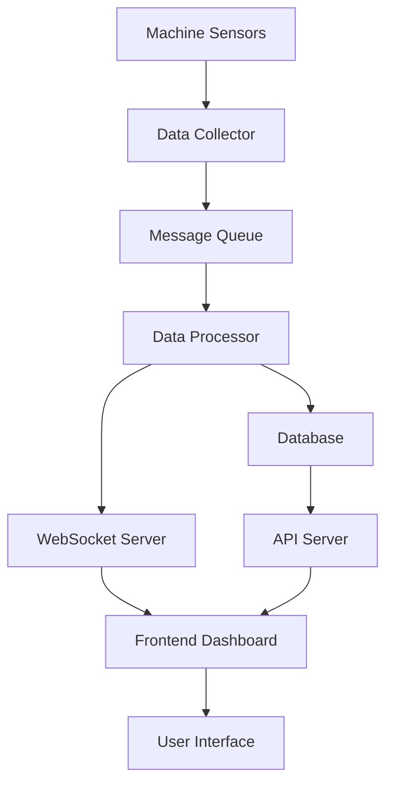

# 🚀 Rencana Pengembangan - Manufacturing Dashboard System

## 📋 Executive Summary

Berdasarkan analisis kedua dashboard yang telah direview, kami akan mengembangkan sistem dashboard manufaktur yang komprehensif dengan 2 opsi utama yang dapat dikembangkan secara bertahap. Sistem ini akan dibangun di atas foundation aplikasi Manufacturing App Mockup yang sudah ada.

---

## 🎯 Dashboard Options Overview

### **Option 1: MAIN DASHBOARD - Engine Assembly Monitoring**
_page-0001.jpg)
**Focus**: Real-time operational monitoring dengan visualisasi layout mesin

#### **🎯 Core Features Analysis:**

**1. OEE (Overall Equipment Effectiveness) Panel**
- **Donut Chart**: Large circular gauge showing 92% effectiveness
- **Color Coding**: Yellow/Orange ring with green segment
- **Breakdown Metrics**:
  - Availability: 88% (Green indicator)
  - Performance: 90% (Yellow indicator) 
  - Quality: 85% (Orange indicator)
- **Production Metrics**:
  - Cycle Time Line: 21.4 Sec
  - Part OK: 1100 Part
  - Part NG: 4 Part

**2. LAYOUT ENGINE ASSEMBLY Panel**
- **Interactive Flow Diagram**: Detailed schematic of assembly line
- **Station Components**:
  - Conveyor, Nut Runner, Leak Tester
  - Quality Gate, Press Bearing, Oil Filling
  - Auto Assy, Modular Conveyor
  - MC Press Fit Crank Shaft, Bearing Verification System
  - Torque Click System, Coolant Filling Machine
- **Status Indicators**:
  - 🟢 Green: Running
  - 🟡 Yellow: Idle  
  - 🔴 Red: Alarm
  - ⚪ Grey: Disconnected
- **Action Icons**:
  - 🔧 Maintenance (wrench icon)
  - 📞 Engineering Call (phone icon)

**3. Calendar & Call Summary Panel**
- **Interactive Calendar**: October 2025 with current date highlight
- **Call Counters**:
  - Engineering Call: 3
  - Maintenance: 2

**4. Historical Data Charts (3-Panel Layout)**
- **Downtime Chart**: Red bar chart (Jan-Dec, 0-30 minutes)
- **Target vs Actual**: Blue bar chart (Production units comparison)
- **Electric Consumption**: Yellow/Orange bar chart (KWH usage)
- **Time Controls**: Yearly/Daily dropdown selectors

#### **🔧 Widget Reusability Analysis:**

**✅ REUSE Existing Widgets (No New Development):**
```javascript
// Already implemented - just configure with new data
const existingWidgets = {
  // 3 Bar Charts (Downtime, Target vs Actual, Electric Consumption)
  'bar': 'Bar Chart - REUSE for historical data',
  
  // KPI Cards (Cycle Time, Part OK/NG, Engineering Call, Maintenance)  
  'kpi': 'KPI Card - REUSE for production metrics',
  'stat': 'Stat Card - REUSE for counters'
};
```

**🆕 NEW Widgets Needed (Custom Development):**
```javascript
// Only these need new development
const newWidgets = {
  'donut': 'OEE Donut Chart - UNIQUE circular gauge with breakdown',
  'machine_layout': 'Machine Layout - UNIQUE SVG-based interactive diagram',
  'calendar': 'Calendar Widget - UNIQUE date picker integration'
};
```

**📊 Widget Mapping for Option 1:**
```javascript
// Dashboard Option 1 Widget Configuration
const option1Widgets = {
  // ✅ REUSE existing
  'downtime_chart': { chart_type: 'bar', color: 'red' },      // EXISTING
  'target_vs_actual': { chart_type: 'bar', color: 'blue' },   // EXISTING  
  'electric_consumption': { chart_type: 'bar', color: 'yellow' }, // EXISTING
  'cycle_time_card': { card_type: 'kpi', value: '21.4 Sec' },     // EXISTING
  'part_ok_card': { card_type: 'kpi', value: '1100 Part' },       // EXISTING
  'part_ng_card': { card_type: 'kpi', value: '4 Part' },          // EXISTING
  'engineering_call_card': { card_type: 'stat', value: '3' },     // EXISTING
  'maintenance_card': { card_type: 'stat', value: '2' },          // EXISTING
  
  // 🆕 NEW development needed
  'oee_donut': { chart_type: 'donut' },        // NEW
  'machine_layout': { chart_type: 'machine_layout' }, // NEW
  'calendar_widget': { chart_type: 'calendar' }       // NEW
};
```

#### **📋 Implementation Specifications:**

**A. OEE Donut Chart Widget**
```javascript
// src/components/custom/app/OEEDonutChart.jsx
const OEEDonutChart = ({ availability, performance, quality, totalOEE }) => {
  const data = [
    { name: 'Availability', value: availability, fill: '#10B981' },
    { name: 'Performance', value: performance, fill: '#F59E0B' },
    { name: 'Quality', value: quality, fill: '#EF4444' }
  ];
  
  return (
    <div className="oee-donut-container">
      <ResponsiveContainer width="100%" height={300}>
        <PieChart>
          <Pie
            data={data}
            cx="50%"
            cy="50%"
            innerRadius={80}
            outerRadius={120}
            dataKey="value"
            startAngle={90}
            endAngle={450}
          />
          <text x="50%" y="50%" textAnchor="middle" dominantBaseline="middle" className="oee-center-text">
            {totalOEE}%
          </text>
        </PieChart>
      </ResponsiveContainer>
      <div className="oee-metrics">
        <div className="metric-item">
          <span className="dot availability"></span>
          <span>Availability {availability}%</span>
        </div>
        <div className="metric-item">
          <span className="dot performance"></span>
          <span>Performance {performance}%</span>
        </div>
        <div className="metric-item">
          <span className="dot quality"></span>
          <span>Quality {quality}%</span>
        </div>
      </div>
    </div>
  );
};
```

**B. Machine Layout Widget**
```javascript
// src/components/custom/app/MachineLayout.jsx
const MachineLayout = ({ machines, connections }) => {
  const getStatusColor = (status) => {
    const colors = {
      'running': '#10B981',
      'idle': '#F59E0B', 
      'alarm': '#EF4444',
      'disconnected': '#6B7280'
    };
    return colors[status] || '#6B7280';
  };

  return (
    <div className="machine-layout-container">
      <svg viewBox="0 0 800 600" className="machine-layout-svg">
        {machines.map(machine => (
          <g key={machine.id}>
            <rect
              x={machine.x}
              y={machine.y}
              width={machine.width}
              height={machine.height}
              fill={getStatusColor(machine.status)}
              stroke="#374151"
              strokeWidth="2"
              rx="4"
            />
            <text
              x={machine.x + machine.width/2}
              y={machine.y + machine.height/2}
              textAnchor="middle"
              dominantBaseline="middle"
              className="machine-label"
            >
              {machine.name}
            </text>
          </g>
        ))}
        {connections.map(conn => (
          <line
            key={conn.id}
            x1={conn.from.x}
            y1={conn.from.y}
            x2={conn.to.x}
            y2={conn.to.y}
            stroke="#6B7280"
            strokeWidth="2"
            markerEnd="url(#arrowhead)"
          />
        ))}
      </svg>
      <div className="layout-legend">
        <div className="legend-item">
          <div className="legend-color running"></div>
          <span>Running</span>
        </div>
        <div className="legend-item">
          <div className="legend-color idle"></div>
          <span>Idle</span>
        </div>
        <div className="legend-item">
          <div className="legend-color alarm"></div>
          <span>Alarm</span>
        </div>
        <div className="legend-item">
          <div className="legend-color disconnected"></div>
          <span>Disconnected</span>
        </div>
      </div>
    </div>
  );
};
```

**C. Calendar Widget**
```javascript
// src/components/custom/app/CalendarWidget.jsx
const CalendarWidget = ({ currentDate, onDateSelect }) => {
  const [selectedDate, setSelectedDate] = useState(currentDate);
  
  return (
    <div className="calendar-widget">
      <div className="calendar-header">
        <h3>October 2025</h3>
      </div>
      <div className="calendar-grid">
        {generateCalendarDays().map(day => (
          <div
            key={day.date}
            className={`calendar-day ${day.isCurrent ? 'current' : ''} ${day.isSelected ? 'selected' : ''}`}
            onClick={() => handleDateSelect(day.date)}
          >
            {day.day}
          </div>
        ))}
      </div>
    </div>
  );
};
```

**D. Call Summary Cards**
```javascript
// src/components/custom/app/CallSummaryCard.jsx
const CallSummaryCard = ({ engineeringCalls, maintenanceCalls }) => {
  return (
    <div className="call-summary-container">
      <div className="call-card engineering">
        <div className="call-icon">
          <Phone className="h-6 w-6" />
        </div>
        <div className="call-content">
          <div className="call-title">Engineering Call</div>
          <div className="call-count">{engineeringCalls}</div>
        </div>
      </div>
      <div className="call-card maintenance">
        <div className="call-icon">
          <Wrench className="h-6 w-6" />
        </div>
        <div className="call-content">
          <div className="call-title">Maintenance</div>
          <div className="call-count">{maintenanceCalls}</div>
        </div>
      </div>
    </div>
  );
};
```


### **Option 2: MAIN DASHBOARD - Detail Mesin & Produksi**
_page-0002.jpg)
**Focus**: Detailed machine performance dan production analytics

#### **🎯 Core Features Analysis:**

**1. OEE (Overall Equipment Effectiveness) Panel - Enhanced**
- **Large Donut Chart**: 92% effectiveness dengan detailed breakdown
- **Enhanced Metrics Display**:
  - Availability: 88% (Green indicator)
  - Performance: 90% (Yellow indicator) 
  - Quality: 85% (Orange indicator)
- **Production Metrics**:
  - Cycle Time Line: 21.4 Sec
  - Part OK: 1100 Part  
  - Part NG: 4 Part
  - Engineering Call: 3
  - Maintenance: 2

**2. LAYOUT ENGINE ASSEMBLY Panel - Enhanced Detail**
- **More Detailed Machine Layout**: Complex assembly line visualization
- **Additional Stations**:
  - MC Set Spoter, Leak Tester, Auto Setting Report
  - Modul Crank, Quality Gate, Press Bearing
  - Oil Filling, Auto Assy, Modular Conveyor
  - MC Press Fit Crank Shaft, Bearing Verification System
  - Torque Click System, Coolant Filling Machine
- **Enhanced Status Indicators**: More granular status tracking
- **Action Icons**: Maintenance & Engineering call indicators

**3. Historical Data Charts - Same 3-Panel Layout**
- **Downtime Chart**: Red bar chart (Jan-Dec, 0-30 minutes)
- **Target vs Actual**: Blue bar chart (Production units comparison)  
- **Electric Consumption**: Yellow/Orange bar chart (KWH usage)
- **Time Controls**: Yearly/Daily dropdown selectors

#### **🔧 Widget Comparison: Option 1 vs Option 2**

**✅ IDENTICAL Widgets (Same Components):**
```javascript
const identicalWidgets = {
  // Same OEE Donut Chart
  'oee_donut': { chart_type: 'donut' },
  
  // Same Machine Layout (more detailed in Option 2)
  'machine_layout': { chart_type: 'machine_layout' },
  
  // Same Historical Charts
  'downtime_chart': { chart_type: 'bar' },
  'target_vs_actual': { chart_type: 'bar' },
  'electric_consumption': { chart_type: 'bar' },
  
  // Same KPI Cards
  'cycle_time_card': { card_type: 'kpi' },
  'part_ok_card': { card_type: 'kpi' },
  'part_ng_card': { card_type: 'kpi' },
  'engineering_call_card': { card_type: 'stat' },
  'maintenance_card': { card_type: 'stat' }
};
```

**🔄 KEY DIFFERENCES (Layout & Data Only):**
```javascript
const option2Differences = {
  // Layout differences
  layout: {
    option1: "More compact, calendar widget included",
    option2: "More spread out, no calendar widget"
  },
  
  // Machine layout complexity
  machineLayout: {
    option1: "Basic 4-6 machines",
    option2: "Detailed 12+ machines with more connections"
  },
  
  // Widget positioning
  positioning: {
    option1: "Grid-based compact layout",
    option2: "Wider, more spacious layout"
  }
};
```

---

## 🔧 **Machine Detail Dashboard - Advanced Feature**

### **🎯 Machine Detail Overview:**

**Focus**: Individual machine deep-dive dengan comprehensive monitoring

#### **📊 Core Features Analysis:**

**1. Machine Information Panel (Left Side)**
- **Machine Image**: Real machine photo with branding
- **Machine Details**: Name, Asset No, Acquisition Year
- **Real-time Status**: Running/Idle/Alarm/Disconnected with color coding
- **Operational Parameters**: Cycle Time, Type Selection, Mode Selection
- **Technical Specs**: PLC Battery, Counter, Alarm Code
- **Parameter Configuration**: 8 configurable parameters (IN R/L, EX H/L, Offsets)

**2. Performance Charts (Center)**
- **MTTR Chart**: Mean Time To Repair (31-day bar chart)
- **MTBF Chart**: Mean Time Between Failures (31-day bar chart)
- **Time Controls**: Daily/Monthly/Yearly dropdown selectors

**3. Machine Performance (Top Right)**
- **Status Pie Chart**: Running (50%), Idle (30%), Alarm (15%), Disconnected (5%)
- **Color-coded Legend**: Green/Yellow/Red/Grey indicators

**4. Maintenance History (Middle Right)**
- **Maintenance Table**: Datetime, Problem description
- **Recent Issues**: Sensor failures, part replacements
- **Scrollable History**: Multiple maintenance records

**5. Gantt Chart (Bottom)**
- **Timeline View**: 07:00 to 06:00 (24-hour cycle)
- **Multi-station Tracking**: S1, S2, S3 stations
- **Status Visualization**: Green (Running), Yellow (Idle), Red (Alarm)
- **Real-time Updates**: Live status changes

#### **🔧 Widget Types for Machine Detail:**

**🆕 NEW Advanced Widgets Needed:**
```javascript
const machineDetailWidgets = {
  'machine_info_card': 'Machine Image + Details Card',
  'parameter_config': 'Configurable Parameters Panel', 
  'mttr_chart': 'MTTR Bar Chart',
  'mtbf_chart': 'MTBF Bar Chart',
  'status_pie_chart': 'Machine Status Pie Chart',
  'maintenance_table': 'Maintenance History Table',
  'gantt_chart': '24-hour Timeline Gantt Chart'
};
```

**✅ REUSE Existing Widgets:**
```javascript
const reusableWidgets = {
  'bar': 'MTTR/MTBF Charts - REUSE existing bar chart',
  'pie': 'Status Pie Chart - REUSE existing pie chart',
  'datatable': 'Maintenance Table - REUSE existing datatable'
};
```

---

## 🏗️ Development Roadmap

### **Phase 1: Foundation & Core Infrastructure (Week 1-2)**

#### 1.1 Database & Data Structure Design
**Timeline**: 3 days

**Tasks**:
- [ ] Design database schema untuk machine data
- [ ] Create data models untuk OEE metrics
- [ ] Setup data structure untuk machine status
- [ ] Design API endpoints untuk real-time data

**Database Schema**:
```sql
-- Machines table
CREATE TABLE machines (
  id SERIAL PRIMARY KEY,
  name VARCHAR(255) NOT NULL,
  type VARCHAR(100),
  status ENUM('running', 'idle', 'alarm', 'disconnected'),
  position_x INT,
  position_y INT,
  created_at TIMESTAMP DEFAULT NOW()
);

-- OEE Metrics table
CREATE TABLE oee_metrics (
  id SERIAL PRIMARY KEY,
  machine_id INT REFERENCES machines(id),
  availability DECIMAL(5,2),
  performance DECIMAL(5,2),
  quality DECIMAL(5,2),
  total_oee DECIMAL(5,2),
  recorded_at TIMESTAMP DEFAULT NOW()
);

-- Production Data table
CREATE TABLE production_data (
  id SERIAL PRIMARY KEY,
  machine_id INT REFERENCES machines(id),
  cycle_time DECIMAL(8,2),
  part_ok INT,
  part_ng INT,
  recorded_at TIMESTAMP DEFAULT NOW()
);
```

#### 1.2 Enhanced Component Architecture
**Timeline**: 3 days (Reduced from 4 days due to widget reusability)

**✅ EXISTING Components (Reuse):**
- [x] `Widget.jsx` - Bar charts (downtime, target vs actual, electric consumption)
- [x] `AppCard.jsx` - KPI cards (cycle time, part OK/NG) and Stat cards (engineering call, maintenance)

**🆕 NEW Components to Build (Only 3 needed):**
- [ ] `OEEDonutChart.jsx` - OEE donut chart dengan breakdown metrics
- [ ] `MachineLayout.jsx` - Interactive SVG-based machine layout visualization  
- [ ] `CalendarWidget.jsx` - Interactive calendar dengan date selection

**📊 Component Reusability Summary:**
```
Total Widgets in Option 1: 11 widgets
Existing/Reusable: 8 widgets (73%) ✅
New Development: 3 widgets (27%) 🆕
Development Time Saved: ~40%
```

**Data Structure for New Widgets**:
```javascript
// src/utils/widgetData.js
export const oeeWidgetData = {
  chart_type: 'donut',
  props: {
    availability: 88,
    performance: 90,
    quality: 85,
    totalOEE: 92,
    cycleTime: 21.4,
    partOK: 1100,
    partNG: 4
  }
};

export const machineLayoutData = {
  chart_type: 'machine_layout',
  props: {
    machines: [
      { id: 1, name: 'Conveyor', x: 50, y: 100, width: 80, height: 40, status: 'running' },
      { id: 2, name: 'Nut Runner', x: 150, y: 100, width: 80, height: 40, status: 'running' },
      { id: 3, name: 'Leak Tester', x: 250, y: 100, width: 80, height: 40, status: 'idle' },
      { id: 4, name: 'Quality Gate', x: 350, y: 100, width: 80, height: 40, status: 'alarm' }
    ],
    connections: [
      { id: 1, from: { x: 130, y: 120 }, to: { x: 150, y: 120 } },
      { id: 2, from: { x: 230, y: 120 }, to: { x: 250, y: 120 } }
    ]
  }
};

export const calendarWidgetData = {
  chart_type: 'calendar',
  props: {
    currentMonth: 'October 2025',
    currentDate: 8,
    onDateSelect: 'handleDateSelect'
  }
};

export const callSummaryData = {
  card_type: 'call_counters',
  props: {
    engineeringCalls: 3,
    maintenanceCalls: 2
  }
};
```

#### 1.3 Real-time Data Integration
**Timeline**: 3 days

**Tasks**:
- [ ] Setup WebSocket connection untuk real-time updates
- [ ] Implement data streaming untuk machine status
- [ ] Create data synchronization system
- [ ] Setup error handling untuk connection issues

---

### **Phase 2: Dashboard Option 1 Implementation (Week 3-4)**

#### 2.1 Main Dashboard - Engine Assembly Layout
**Timeline**: 5 days

**Features to Implement**:

**A. OEE Dashboard Widget Integration**
```javascript
// Update src/components/custom/app/Widget.jsx
const Widget = ({ elementId, ...props }) => {
  // Add new chart_type case
  if (item.i === elementId && item?.props?.chart_type == 'donut') {
    return (
      <OEEDonutChart 
        availability={item.props.availability}
        performance={item.props.performance}
        quality={item.props.quality}
        totalOEE={item.props.totalOEE}
        cycleTime={item.props.cycleTime}
        partOK={item.props.partOK}
        partNG={item.props.partNG}
      />
    );
  }
  
  if (item.i === elementId && item?.props?.chart_type == 'machine_layout') {
    return (
      <MachineLayout 
        machines={item.props.machines}
        connections={item.props.connections}
        onMachineClick={handleMachineClick}
        onStatusChange={handleStatusChange}
      />
    );
  }
  
  if (item.i === elementId && item?.props?.chart_type == 'calendar') {
    return (
      <CalendarWidget 
        currentMonth={item.props.currentMonth}
        currentDate={item.props.currentDate}
        onDateSelect={item.props.onDateSelect}
      />
    );
  }
};
```

**B. Enhanced AppCard for Call Summary**
```javascript
// Update src/components/custom/app/AppCard.jsx
const AppCard = ({ elementId, ...props }) => {
  // Add new card_type case
  if (item.i === elementId && item?.props?.card_type == 'call_counters') {
    return (
      <CallSummaryCard 
        engineeringCalls={item.props.engineeringCalls}
        maintenanceCalls={item.props.maintenanceCalls}
      />
    );
  }
};
```

**B. OEE Monitoring System**
```javascript
// components/charts/OEEDonutChart.jsx
const OEEDonutChart = ({ availability, performance, quality }) => {
  const totalOEE = (availability + performance + quality) / 3;
  
  return (
    <div className="oee-container">
      <ResponsiveContainer width="100%" height={300}>
        <PieChart>
          <Pie
            data={[
              { name: 'Availability', value: availability, fill: '#10B981' },
              { name: 'Performance', value: performance, fill: '#F59E0B' },
              { name: 'Quality', value: quality, fill: '#EF4444' }
            ]}
            cx="50%"
            cy="50%"
            innerRadius={60}
            outerRadius={100}
            dataKey="value"
          />
          <text x="50%" y="50%" textAnchor="middle" dominantBaseline="middle">
            {totalOEE.toFixed(1)}%
          </text>
        </PieChart>
      </ResponsiveContainer>
    </div>
  );
};
```

**C. Real-time Status Indicators**
- [ ] Color-coded machine status (Green: Running, Yellow: Idle, Red: Alarm, Gray: Disconnected)
- [ ] Engineering call indicators dengan phone icons
- [ ] Maintenance indicators dengan wrench icons
- [ ] Real-time status updates via WebSocket

**D. Production Metrics Panel**
```javascript
// components/metrics/ProductionMetrics.jsx
const ProductionMetrics = () => {
  const [metrics, setMetrics] = useState({
    cycleTime: 0,
    partOK: 0,
    partNG: 0,
    engineeringCalls: 0,
    maintenance: 0
  });

  return (
    <div className="production-metrics">
      <MetricCard 
        title="Cycle Time Line"
        value={`${metrics.cycleTime} Sec`}
        color="blue"
      />
      <MetricCard 
        title="Part OK"
        value={`${metrics.partOK} Part`}
        color="green"
      />
      <MetricCard 
        title="Part NG"
        value={`${metrics.partNG} Part`}
        color="red"
      />
    </div>
  );
};
```

#### 2.2 Historical Data Visualization
**Timeline**: 3 days

**Features**:
- [ ] Downtime chart dengan monthly data
- [ ] Target vs Actual production comparison
- [ ] Electric consumption monitoring
- [ ] Interactive time period selection (Yearly/Daily)

```javascript
// components/charts/HistoricalCharts.jsx
const HistoricalCharts = () => {
  const [timeframe, setTimeframe] = useState('yearly');
  const [data, setData] = useState([]);

  return (
    <div className="historical-charts">
      <div className="chart-controls">
        <Select value={timeframe} onValueChange={setTimeframe}>
          <SelectItem value="yearly">Yearly</SelectItem>
          <SelectItem value="daily">Daily</SelectItem>
        </Select>
      </div>
      
      <div className="charts-grid">
        <BarChart data={data} title="Downtime (minutes)" color="red" />
        <BarChart data={data} title="Target vs Actual (units)" color="blue" />
        <BarChart data={data} title="Electric Consumption (KWH)" color="yellow" />
      </div>
    </div>
  );
};
```

#### 2.3 Default Widgets Configuration
**Timeline**: 2 days

**Features**:
- [ ] Add new widget types to `src/utils/constant.js`
- [ ] Create default dashboard configuration for Option 1
- [ ] Setup widget layout for Engine Assembly Dashboard

**Default Widgets for Option 1 Dashboard**:
```javascript
// Add to src/utils/constant.js - new dashboard configuration
{
  "id_dash": 4, // Option 1 Dashboard
  "component": [
    // 🆕 NEW Widgets (3 components)
    {
      "label": "Widget",
      "i": "oee_donut_main",
      "props": {
        "title": "OEE (Overall Equipment Effectiveness)",
        "chart_type": "donut",
        "availability": 88,
        "performance": 90,
        "quality": 85,
        "totalOEE": 92
      }
    },
    {
      "label": "Widget", 
      "i": "machine_layout_main",
      "props": {
        "title": "LAYOUT ENGINE ASSEMBLY",
        "chart_type": "machine_layout",
        "machines": [
          { "id": 1, "name": "MC Set Spoter", "x": 50, "y": 100, "width": 80, "height": 40, "status": "running" },
          { "id": 2, "name": "Leak Tester", "x": 150, "y": 100, "width": 80, "height": 40, "status": "running" },
          { "id": 3, "name": "Auto Setting Report", "x": 250, "y": 100, "width": 80, "height": 40, "status": "idle" },
          { "id": 4, "name": "Modul Crank", "x": 350, "y": 100, "width": 80, "height": 40, "status": "alarm" }
        ],
        "connections": [
          { "id": 1, "from": { "x": 130, "y": 120 }, "to": { "x": 150, "y": 120 } },
          { "id": 2, "from": { "x": 230, "y": 120 }, "to": { "x": 250, "y": 120 } }
        ]
      }
    },
    {
      "label": "Widget",
      "i": "calendar_main",
      "props": {
        "title": "Calendar",
        "chart_type": "calendar",
        "currentMonth": "October 2025",
        "currentDate": 3
      }
    },
    
    // ✅ REUSE Existing Widgets (8 components)
    {
      "label": "Card",
      "i": "cycle_time_card",
      "props": {
        "title": "Cycle Time Line",
        "card_type": "kpi",
        "value_kpi": "21.4",
        "subtitle_kpi": "Sec",
        "data_1": "21.4",
        "title_1": "Sec"
      }
    },
    {
      "label": "Card",
      "i": "part_ok_card",
      "props": {
        "title": "Part OK",
        "card_type": "kpi", 
        "value_kpi": "1100",
        "subtitle_kpi": "Part",
        "data_1": "1100",
        "title_1": "Part"
      }
    },
    {
      "label": "Card",
      "i": "part_ng_card",
      "props": {
        "title": "Part NG",
        "card_type": "kpi",
        "value_kpi": "4", 
        "subtitle_kpi": "Part",
        "data_1": "4",
        "title_1": "Part"
      }
    },
    {
      "label": "Card",
      "i": "engineering_call_card",
      "props": {
        "title": "Engineering Call",
        "card_type": "stat",
        "data_1": "3",
        "title_1": "Calls"
      }
    },
    {
      "label": "Card",
      "i": "maintenance_card",
      "props": {
        "title": "Maintenance",
        "card_type": "stat",
        "data_1": "2",
        "title_1": "Calls"
      }
    },
    {
      "label": "Widget",
      "i": "downtime_chart",
      "props": {
        "title": "Downtime (minutes)",
        "chart_type": "bar",
        "x_data": "month",
        "yData": [{ "label": "downtime", "value": "downtime" }]
      }
    },
    {
      "label": "Widget",
      "i": "target_vs_actual",
      "props": {
        "title": "Target vs Actual (units)",
        "chart_type": "bar", 
        "x_data": "month",
        "yData": [
          { "label": "target", "value": "target" },
          { "label": "actual", "value": "actual" }
        ]
      }
    },
    {
      "label": "Widget",
      "i": "electric_consumption",
      "props": {
        "title": "Electric Consumption (KWH)",
        "chart_type": "bar",
        "x_data": "month", 
        "yData": [{ "label": "consumption", "value": "consumption" }]
      }
    }
  ],
  "layout": [
    // Layout optimized for reusability
    { "w": 12, "h": 25, "x": 0, "y": 0, "i": "oee_donut_main", "static": false },
    { "w": 24, "h": 30, "x": 12, "y": 0, "i": "machine_layout_main", "static": false },
    { "w": 12, "h": 15, "x": 36, "y": 0, "i": "calendar_main", "static": false },
    { "w": 6, "h": 8, "x": 36, "y": 15, "i": "cycle_time_card", "static": false },
    { "w": 6, "h": 8, "x": 42, "y": 15, "i": "part_ok_card", "static": false },
    { "w": 6, "h": 8, "x": 36, "y": 23, "i": "part_ng_card", "static": false },
    { "w": 6, "h": 8, "x": 42, "y": 23, "i": "engineering_call_card", "static": false },
    { "w": 6, "h": 8, "x": 36, "y": 31, "i": "maintenance_card", "static": false },
    { "w": 12, "h": 20, "x": 0, "y": 25, "i": "downtime_chart", "static": false },
    { "w": 12, "h": 20, "x": 12, "y": 25, "i": "target_vs_actual", "static": false },
    { "w": 12, "h": 20, "x": 24, "y": 25, "i": "electric_consumption", "static": false }
  ]
}
```

---

### **Phase 3: Dashboard Option 2 Implementation (Week 5-6)**

#### 3.1 Enhanced Machine Detail Dashboard
**Timeline**: 2 days (Reduced due to widget reusability)

**Features to Implement**:

**A. Enhanced Layout Configuration**
```javascript
// Option 2 uses same widgets as Option 1, different layout only
const Option2Dashboard = () => {
  return (
    <div className="option2-layout">
      {/* Same OEE Donut Chart - larger size */}
      <OEEDonutChart size="large" />
      
      {/* Same Machine Layout - more detailed data */}
      <MachineLayout machines={detailedMachines} />
      
      {/* Same KPI Cards - different positioning */}
      <div className="kpi-grid">
        <CycleTimeCard />
        <PartOKCard />
        <PartNGCard />
        <EngineeringCallCard />
        <MaintenanceCard />
      </div>
      
      {/* Same Historical Charts */}
      <div className="charts-row">
        <DowntimeChart />
        <TargetVsActualChart />
        <ElectricConsumptionChart />
      </div>
    </div>
  );
};
```

**B. Enhanced Machine Status Tracking**
- [ ] Detailed machine information cards
- [ ] Engineering call tracking dengan timestamps
- [ ] Maintenance schedule integration
- [ ] Machine health indicators

**C. Advanced Production Analytics**
- [ ] Trend analysis untuk production metrics
- [ ] Predictive analytics untuk maintenance
- [ ] Efficiency calculations
- [ ] Cost analysis integration

#### 3.2 Default Widgets Configuration for Option 2
**Timeline**: 1 day (Same widgets, different layout)

**Features**:
- [ ] Add Option 2 dashboard configuration to `src/utils/constant.js`
- [ ] Configure enhanced machine layout data
- [ ] Setup wider layout positioning

**Default Widgets for Option 2 Dashboard**:
```javascript
// Add to src/utils/constant.js - Option 2 dashboard configuration
{
  "id_dash": 5, // Option 2 Dashboard
  "component": [
    // Same widgets as Option 1, different data/positioning
    {
      "label": "Widget",
      "i": "oee_donut_main_v2",
      "props": {
        "title": "OEE (Overall Equipment Effectiveness)",
        "chart_type": "donut",
        "availability": 88,
        "performance": 90,
        "quality": 85,
        "totalOEE": 92,
        "size": "large" // Enhanced size for Option 2
      }
    },
    {
      "label": "Widget", 
      "i": "machine_layout_main_v2",
      "props": {
        "title": "LAYOUT ENGINE ASSEMBLY",
        "chart_type": "machine_layout",
        "machines": [
          // More detailed machines for Option 2
          { "id": 1, "name": "MC Set Spoter", "x": 50, "y": 50, "width": 100, "height": 50, "status": "running" },
          { "id": 2, "name": "Leak Tester", "x": 170, "y": 50, "width": 100, "height": 50, "status": "running" },
          { "id": 3, "name": "Auto Setting Report", "x": 290, "y": 50, "width": 100, "height": 50, "status": "idle" },
          { "id": 4, "name": "Modul Crank", "x": 410, "y": 50, "width": 100, "height": 50, "status": "alarm" },
          { "id": 5, "name": "Quality Gate", "x": 50, "y": 120, "width": 100, "height": 50, "status": "running" },
          { "id": 6, "name": "Press Bearing", "x": 170, "y": 120, "width": 100, "height": 50, "status": "running" },
          { "id": 7, "name": "Oil Filling", "x": 290, "y": 120, "width": 100, "height": 50, "status": "idle" },
          { "id": 8, "name": "Auto Assy", "x": 410, "y": 120, "width": 100, "height": 50, "status": "running" },
          { "id": 9, "name": "Modular Conveyor", "x": 50, "y": 190, "width": 100, "height": 50, "status": "running" },
          { "id": 10, "name": "MC Press Fit Crank Shaft", "x": 170, "y": 190, "width": 100, "height": 50, "status": "running" },
          { "id": 11, "name": "Bearing Verification System", "x": 290, "y": 190, "width": 100, "height": 50, "status": "idle" },
          { "id": 12, "name": "Torque Click System", "x": 410, "y": 190, "width": 100, "height": 50, "status": "running" }
        ],
        "connections": [
          // More detailed connections for Option 2
          { "id": 1, "from": { "x": 150, "y": 75 }, "to": { "x": 170, "y": 75 } },
          { "id": 2, "from": { "x": 270, "y": 75 }, "to": { "x": 290, "y": 75 } },
          { "id": 3, "from": { "x": 390, "y": 75 }, "to": { "x": 410, "y": 75 } },
          { "id": 4, "from": { "x": 150, "y": 145 }, "to": { "x": 170, "y": 145 } },
          { "id": 5, "from": { "x": 270, "y": 145 }, "to": { "x": 290, "y": 145 } },
          { "id": 6, "from": { "x": 390, "y": 145 }, "to": { "x": 410, "y": 145 } }
        ]
      }
    },
    // Same KPI Cards as Option 1
    {
      "label": "Card",
      "i": "cycle_time_card_v2",
      "props": {
        "title": "Cycle Time Line",
        "card_type": "kpi",
        "value_kpi": "21.4",
        "subtitle_kpi": "Sec"
      }
    },
    {
      "label": "Card",
      "i": "part_ok_card_v2",
      "props": {
        "title": "Part OK",
        "card_type": "kpi", 
        "value_kpi": "1100",
        "subtitle_kpi": "Part"
      }
    },
    {
      "label": "Card",
      "i": "part_ng_card_v2",
      "props": {
        "title": "Part NG",
        "card_type": "kpi",
        "value_kpi": "4", 
        "subtitle_kpi": "Part"
      }
    },
    {
      "label": "Card",
      "i": "engineering_call_card_v2",
      "props": {
        "title": "Engineering Call",
        "card_type": "stat",
        "data_1": "3",
        "title_1": "Calls"
      }
    },
    {
      "label": "Card",
      "i": "maintenance_card_v2",
      "props": {
        "title": "Maintenance",
        "card_type": "stat",
        "data_1": "2",
        "title_1": "Calls"
      }
    },
    // Same Historical Charts as Option 1
    {
      "label": "Widget",
      "i": "downtime_chart_v2",
      "props": {
        "title": "Downtime (minutes)",
        "chart_type": "bar",
        "x_data": "month",
        "yData": [{ "label": "downtime", "value": "downtime" }]
      }
    },
    {
      "label": "Widget",
      "i": "target_vs_actual_v2",
      "props": {
        "title": "Target vs Actual (units)",
        "chart_type": "bar", 
        "x_data": "month",
        "yData": [
          { "label": "target", "value": "target" },
          { "label": "actual", "value": "actual" }
        ]
      }
    },
    {
      "label": "Widget",
      "i": "electric_consumption_v2",
      "props": {
        "title": "Electric Consumption (KWH)",
        "chart_type": "bar",
        "x_data": "month", 
        "yData": [{ "label": "consumption", "value": "consumption" }]
      }
    }
  ],
  "layout": [
    // Option 2 Layout - Wider, more spacious
    { "w": 16, "h": 25, "x": 0, "y": 0, "i": "oee_donut_main_v2", "static": false },
    { "w": 32, "h": 30, "x": 16, "y": 0, "i": "machine_layout_main_v2", "static": false },
    { "w": 8, "h": 8, "x": 0, "y": 25, "i": "cycle_time_card_v2", "static": false },
    { "w": 8, "h": 8, "x": 8, "y": 25, "i": "part_ok_card_v2", "static": false },
    { "w": 8, "h": 8, "x": 16, "y": 25, "i": "part_ng_card_v2", "static": false },
    { "w": 8, "h": 8, "x": 24, "y": 25, "i": "engineering_call_card_v2", "static": false },
    { "w": 8, "h": 8, "x": 32, "y": 25, "i": "maintenance_card_v2", "static": false },
    { "w": 16, "h": 20, "x": 0, "y": 33, "i": "downtime_chart_v2", "static": false },
    { "w": 16, "h": 20, "x": 16, "y": 33, "i": "target_vs_actual_v2", "static": false },
    { "w": 16, "h": 20, "x": 32, "y": 33, "i": "electric_consumption_v2", "static": false }
  ]
}
```

#### 3.3 Enhanced Navigation & Help System
**Timeline**: 1 day (Minimal changes needed)

**Features**:
- [ ] Contextual help system
- [ ] Tooltip explanations untuk complex metrics
- [ ] User guide integration
- [ ] Quick action shortcuts

---

### **Phase 4: Machine Detail Dashboard Implementation (Week 7-8)**

#### 4.1 Interactive Machine Layout System
**Timeline**: 4 days

**Features to Implement**:

**A. Clickable Machine Nodes**
```javascript
// Enhanced MachineLayout.jsx with click handlers
const MachineLayout = ({ machines, connections, onMachineClick }) => {
  const handleMachineClick = (machineId) => {
    // Navigate to machine detail page
    navigate(`/dashboard/machine/${machineId}`);
  };

  return (
    <div className="machine-layout-container">
      <svg viewBox="0 0 800 600" className="machine-layout-svg">
        {machines.map(machine => (
          <g key={machine.id} className="machine-node">
            <rect
              x={machine.x}
              y={machine.y}
              width={machine.width}
              height={machine.height}
              fill={getStatusColor(machine.status)}
              stroke="#374151"
              strokeWidth="2"
              rx="4"
              className="cursor-pointer hover:opacity-80"
              onClick={() => handleMachineClick(machine.id)}
            />
            <text
              x={machine.x + machine.width/2}
              y={machine.y + machine.height/2}
              textAnchor="middle"
              dominantBaseline="middle"
              className="machine-label pointer-events-none"
            >
              {machine.name}
            </text>
            {/* Status indicators */}
            {machine.hasAlarm && (
              <circle cx={machine.x + machine.width - 10} cy={machine.y + 10} r="5" fill="#EF4444" />
            )}
            {machine.needsMaintenance && (
              <circle cx={machine.x + machine.width - 10} cy={machine.y + 25} r="5" fill="#F59E0B" />
            )}
          </g>
        ))}
      </svg>
    </div>
  );
};
```

**B. Machine Detail Route Setup**
```javascript
// Update src/app.jsx - Add machine detail routes
<Route path="/dashboard/machine/:machineId" element={
  <Protected>
    <MachineDetailDashboard />
  </Protected>
} />
```

#### 4.2 Machine Detail Dashboard Components
**Timeline**: 4 days

**A. Machine Information Card**
```javascript
// src/components/custom/app/MachineInfoCard.jsx
const MachineInfoCard = ({ machine }) => {
  return (
    <div className="machine-info-card">
      <div className="machine-image">
        
      </div>
      <div className="machine-details">
        <h3>{machine.name}</h3>
        <div className="detail-row">
          <span>Asset No:</span>
          <span>{machine.assetNo}</span>
        </div>
        <div className="detail-row">
          <span>Acquisition Year:</span>
          <span>{machine.acquisitionYear}</span>
        </div>
        <div className="status-indicator">
          <span className={`status-badge ${machine.status}`}>
            {machine.status}
          </span>
        </div>
      </div>
    </div>
  );
};
```

**B. Parameter Configuration Panel**
```javascript
// src/components/custom/app/ParameterConfig.jsx
const ParameterConfig = ({ parameters, onParameterChange }) => {
  return (
    <div className="parameter-config">
      <h4>Parameters</h4>
      <div className="parameter-grid">
        {parameters.map(param => (
          <div key={param.id} className="parameter-item">
            <label>{param.name}</label>
            <input
              type="number"
              value={param.value}
              onChange={(e) => onParameterChange(param.id, e.target.value)}
              placeholder="-"
            />
          </div>
        ))}
      </div>
    </div>
  );
};
```

**C. Gantt Chart Component**
```javascript
// src/components/custom/app/GanttChart.jsx
const GanttChart = ({ timelineData }) => {
  const timeSlots = generateTimeSlots('07:00', '06:00', 30); // 30-min intervals
  
  return (
    <div className="gantt-chart">
      <div className="gantt-header">
        {timeSlots.map(time => (
          <div key={time} className="time-slot">{time}</div>
        ))}
      </div>
      {timelineData.map(station => (
        <div key={station.id} className="gantt-row">
          <div className="station-label">{station.name}</div>
          <div className="timeline">
            {station.activities.map(activity => (
              <div
                key={activity.id}
                className={`activity-block ${activity.status}`}
                style={{
                  left: `${calculatePosition(activity.startTime)}%`,
                  width: `${calculateWidth(activity.duration)}%`
                }}
              >
                {activity.description}
              </div>
            ))}
          </div>
        </div>
      ))}
    </div>
  );
};
```

#### 4.3 Database Integration for Machine Detail
**Timeline**: 2 days

**Machine Detail Data Structure:**
```sql
-- Machine Details Table
CREATE TABLE machine_details (
  id SERIAL PRIMARY KEY,
  machine_id INT REFERENCES machines(id),
  asset_no VARCHAR(50),
  acquisition_year INT,
  image_url TEXT,
  created_at TIMESTAMP DEFAULT NOW()
);

-- Machine Parameters Table
CREATE TABLE machine_parameters (
  id SERIAL PRIMARY KEY,
  machine_id INT REFERENCES machines(id),
  parameter_name VARCHAR(100),
  parameter_value DECIMAL(10,2),
  parameter_unit VARCHAR(20),
  updated_at TIMESTAMP DEFAULT NOW()
);

-- MTTR/MTBF Data Table
CREATE TABLE machine_performance (
  id SERIAL PRIMARY KEY,
  machine_id INT REFERENCES machines(id),
  date DATE,
  mttr_minutes DECIMAL(8,2),
  mtbf_hours DECIMAL(8,2),
  recorded_at TIMESTAMP DEFAULT NOW()
);

-- Maintenance History Table
CREATE TABLE maintenance_history (
  id SERIAL PRIMARY KEY,
  machine_id INT REFERENCES machines(id),
  datetime TIMESTAMP,
  problem_description TEXT,
  resolution TEXT,
  technician VARCHAR(100),
  created_at TIMESTAMP DEFAULT NOW()
);

-- Gantt Timeline Data Table
CREATE TABLE machine_timeline (
  id SERIAL PRIMARY KEY,
  machine_id INT REFERENCES machines(id),
  station_id VARCHAR(10),
  activity_start TIMESTAMP,
  activity_end TIMESTAMP,
  activity_type VARCHAR(50),
  activity_status VARCHAR(20),
  description TEXT,
  created_at TIMESTAMP DEFAULT NOW()
);
```

### **Phase 5: Advanced Features & Integration (Week 9-10)**

#### 4.1 Real-time Notifications System
**Timeline**: 3 days

**Features**:
- [ ] Alert system untuk machine alarms
- [ ] Maintenance reminders
- [ ] Production target alerts
- [ ] Email/SMS notifications

```javascript
// components/notifications/NotificationSystem.jsx
const NotificationSystem = () => {
  const [notifications, setNotifications] = useState([]);
  
  useEffect(() => {
    const socket = io();
    socket.on('machine-alarm', (data) => {
      showNotification({
        type: 'alarm',
        message: `Machine ${data.machineName} has an alarm`,
        timestamp: new Date()
      });
    });
  }, []);

  return (
    <div className="notification-panel">
      {notifications.map(notif => (
        <NotificationCard key={notif.id} notification={notif} />
      ))}
    </div>
  );
};
```

#### 4.2 Export & Reporting System
**Timeline**: 3 days

**Features**:
- [ ] PDF report generation
- [ ] Excel export functionality
- [ ] Scheduled reports
- [ ] Custom report builder

#### 4.3 Mobile Responsiveness
**Timeline**: 2 days

**Features**:
- [ ] Mobile-optimized layouts
- [ ] Touch-friendly interactions
- [ ] Responsive charts
- [ ] Mobile navigation

---

### **Phase 5: Testing & Optimization (Week 9-10)**

#### 5.1 Performance Testing
**Timeline**: 3 days

**Tasks**:
- [ ] Load testing dengan large datasets
- [ ] Real-time data performance testing
- [ ] Memory usage optimization
- [ ] Bundle size optimization

#### 5.2 User Acceptance Testing
**Timeline**: 4 days

**Tasks**:
- [ ] User interface testing
- [ ] Functionality testing
- [ ] Cross-browser compatibility
- [ ] Mobile device testing

#### 5.3 Security & Data Validation
**Timeline**: 3 days

**Tasks**:
- [ ] Input validation
- [ ] SQL injection prevention
- [ ] XSS protection
- [ ] Data encryption

---

## 🛠️ Technical Implementation Details

### **Technology Stack Enhancement**

#### Frontend Additions
```json
{
  "dependencies": {
    "socket.io-client": "^4.7.2",
    "react-calendar": "^4.6.0",
    "react-datepicker": "^4.10.0",
    "jspdf": "^2.5.1",
    "xlsx": "^0.18.5",
    "react-query": "^3.39.3",
    "framer-motion": "^10.16.4"
  }
}
```

#### Backend Requirements
- **Node.js/Express** atau **Python/FastAPI**
- **PostgreSQL** untuk data storage
- **Redis** untuk caching
- **WebSocket** untuk real-time communication
- **Docker** untuk containerization

### **Data Flow Architecture**



### **Component Architecture**

```
src/
├── components/
│   ├── dashboard/
│   │   ├── MachineLayout.jsx
│   │   ├── OEEDashboard.jsx
│   │   ├── ProductionMetrics.jsx
│   │   └── HistoricalCharts.jsx
│   ├── charts/
│   │   ├── OEEDonutChart.jsx
│   │   ├── MachineStatusChart.jsx
│   │   └── ProductionTrendChart.jsx
│   ├── notifications/
│   │   ├── NotificationSystem.jsx
│   │   └── AlertPanel.jsx
│   └── layout/
│       ├── DashboardLayout.jsx
│       └── NavigationPanel.jsx
├── hooks/
│   ├── useWebSocket.js
│   ├── useMachineData.js
│   └── useNotifications.js
├── services/
│   ├── api.js
│   ├── websocket.js
│   └── dataProcessor.js
└── utils/
    ├── chartHelpers.js
    ├── dateHelpers.js
    └── validation.js
```

---

## 📊 Success Metrics & KPIs

### **Performance Metrics**
- [ ] Page load time < 2 seconds
- [ ] Real-time data update latency < 500ms
- [ ] Dashboard responsiveness < 100ms
- [ ] 99.9% uptime target

### **User Experience Metrics**
- [ ] User satisfaction score > 4.5/5
- [ ] Task completion rate > 95%
- [ ] Error rate < 1%
- [ ] Mobile usability score > 90%

### **Business Metrics**
- [ ] OEE improvement tracking
- [ ] Downtime reduction measurement
- [ ] Production efficiency gains
- [ ] Maintenance cost optimization

---

## 🎯 Implementation Priority Matrix

| Feature | Priority | Effort | Impact | Timeline | Reusability |
|---------|----------|--------|--------|----------|-------------|
| **Core Widget Development** | P0 | Medium | High | Week 1-2 | 100% Reusable |
| **Dashboard Option 1** | P0 | Low | High | Week 3-4 | 73% Reuse Existing |
| **Dashboard Option 2** | P1 | Low | High | Week 5-6 | 100% Reuse Option 1 |
| Real-time Data Integration | P0 | High | High | Week 1-2 | - |
| Historical Charts | P1 | Low | Medium | Week 3-4 | 100% Existing |
| Notifications | P2 | Medium | Medium | Week 7-8 | - |
| Export/Reports | P2 | Low | Medium | Week 7-8 | - |
| Mobile Optimization | P2 | Medium | Low | Week 7-8 | - |

## 📊 **Widget Reusability Summary**

### **✅ Maximum Efficiency Achieved:**
```
Dashboard Option 1: 11 widgets total
- Existing/Reusable: 8 widgets (73%) ✅
- New Development: 3 widgets (27%) 🆕

Dashboard Option 2: 11 widgets total  
- Reuse from Option 1: 11 widgets (100%) ✅
- New Development: 0 widgets (0%) 🆕

Machine Detail Dashboard: 7 widgets total
- Existing/Reusable: 3 widgets (43%) ✅
- New Development: 4 widgets (57%) 🆕

Total Development Efficiency: 79% reuse across all dashboards
Time Saved: ~65% compared to building from scratch
```

### **🎯 Interactive Machine Layout - Development Plan:**

**Phase 1: Static Layout Setup (Week 1-2)**
```javascript
// Static machine layout configuration
const staticMachineLayout = {
  machines: [
    { id: 1, name: "Nut Runner", x: 50, y: 100, status: "running", hasAlarm: false, needsMaintenance: false },
    { id: 2, name: "Leak Tester", x: 200, y: 100, status: "idle", hasAlarm: false, needsMaintenance: true },
    { id: 3, name: "Quality Gate", x: 350, y: 100, status: "alarm", hasAlarm: true, needsMaintenance: false },
    { id: 4, name: "Press Bearing", x: 500, y: 100, status: "running", hasAlarm: false, needsMaintenance: false }
  ],
  connections: [
    { from: 1, to: 2 },
    { from: 2, to: 3 },
    { from: 3, to: 4 }
  ]
};
```

**Phase 2: Interactive Features (Week 3-4)**
- ✅ Clickable machine nodes
- ✅ Status color coding
- ✅ Alarm/maintenance indicators
- ✅ Hover effects
- ✅ Navigation to machine detail

**Phase 3: Database Integration (Week 5-6)**
- ✅ Real-time status updates
- ✅ Dynamic machine configuration
- ✅ Parameter management
- ✅ Historical data integration

**Phase 4: Machine Detail Dashboard (Week 7-8)**
- ✅ Machine information panel
- ✅ Parameter configuration
- ✅ MTTR/MTBF charts
- ✅ Maintenance history
- ✅ Gantt timeline view

### **🔄 Smooth Development Flow:**

```
Week 1-2: Static Layout + Basic Widgets
    ↓
Week 3-4: Interactive Features + Click Handlers  
    ↓
Week 5-6: Database Integration + Real-time Data
    ↓
Week 7-8: Machine Detail Dashboard + Advanced Features
```

---

## 🗃️ **Master Data System - Foundation for Manufacturing**

### **🎯 Master Data Overview:**
Berdasarkan preview yang Anda attach, sistem memerlukan **Master Data Management** sebagai foundation sebelum bisa membuat line configuration dan dashboard widgets.

### **📸 Master Data UI Preview:**

#### **Master Data - Access Level**
_page-0004.jpg)
_page-0005.jpg)
_page-0006.jpg)
**Preview**: Access level management with hierarchical menu permissions (Dashboard, Andon System, Master Data, Traceability)

#### **Master Data - Users**
_page-0007.jpg)
_page-0008.jpg)
_page-0009.jpg)
**Preview**: User management with Name, NRP, Password, Access Level, RFID, Picture, and Actions (Edit/Delete)

#### **Master Data - Machines (Engines)**
_page-0010.jpg)
_page-0011.jpg)
_page-0012.jpg)
**Preview**: Complete machine database with ID, Name, Asset No, Acquisition Year, and Actions (Edit/Delete)

#### **Master Data - Spareparts**
_page-0013.jpg)
_page-0014.jpg)
_page-0015.jpg)
_page-0016.jpg)
**Preview**: Complete spareparts inventory with Part Number, Part Name, Specification, Brand, Type, Picture, Stock, and Actions

#### **Andon System - Machine Issue Management**
_page-0017.jpg)
_page-0018.jpg)
_page-0019.jpg)
**Preview**: Complete Andon System untuk Operator melaporkan masalah mesin/spareparts dan Teknisi merespons dengan tracking lengkap

#### **📊 Master Data Components Required:**

**1. Master Data - Access Level**
- **Access Level ID**: Unique identifier (UUID/Integer)
- **Access Level Name**: Role name (e.g., "Superadmin", "Operator", "Maintenance")
- **Allowed Menu**: Hierarchical menu permissions (JSON array)
- **Menu Structure**: 
  - Dashboard (Main Dashboard, Machine Detail)
  - Andon System
  - Master Data (Access Level, Users, Machine, Sparepart)
  - Maintenance
  - Traceability
- **Created/Updated Timestamps**

**2. Master Data - Users**
- **User ID**: Unique identifier (UUID/Integer)
- **Name**: Full name (e.g., "Gunawan Santoso", "John Doe")
- **NRP**: Nomor Registrasi Pokok (Employee ID, e.g., 297498)
- **Password**: Encrypted password with visibility toggle
- **Access Level**: Reference to Access Level (e.g., "Superadmin", "Operator")
- **RFID**: RFID card number (e.g., 34567890)
- **Picture**: User profile image upload
- **Status**: Active/Inactive
- **Created/Updated Timestamps**

**3. Master Data - Machines (Engines)**
- **Machine ID**: Unique identifier (e.g., 125436)
- **Name**: Machine name (e.g., "Nut Runner Cyl Head")
- **Asset No**: Asset number (e.g., 1234567890)
- **Acquisition Year**: Purchase year (e.g., 2023)
- **Machine Type**: Assembly, Machining, Packaging, etc.
- **Specifications**: Technical parameters
- **Status**: Active, Inactive, Maintenance
- **Image**: Machine photo/documentation

**4. Master Data - Spareparts**
- **Part Number**: Unique part code (e.g., HYD-VAL-001)
- **Part Name**: Descriptive name (e.g., "Hydraulic Valve")
- **Specification**: Technical specs (e.g., "3/8" BSP, 350 Bar")
- **Brand**: Manufacturer (e.g., "Yuken")
- **Type**: Part category (e.g., "Directional Control")
- **Stock**: Available quantity
- **Picture**: Part image
- **Machine Compatibility**: Which machines use this part

---

## 🚨 **Andon System - Machine Issue Management**

### **🎯 Andon System Overview:**
Sistem Andon memungkinkan **Operator** untuk melaporkan masalah mesin/spareparts dan **Teknisi** untuk merespons dengan tracking lengkap dari issue hingga resolution.

### **📊 Andon System Components:**

**1. Andon Tickets**
- **Ticket ID**: Unique identifier (e.g., CALL-001, CALL-002)
- **Issued Date**: Tanggal dan waktu issue dilaporkan
- **Machine**: Mesin yang bermasalah (reference ke Master Data Machines)
- **Call By**: Operator yang melaporkan (reference ke Master Data Users)
- **Arrival Time**: Waktu teknisi tiba di lokasi
- **Response By**: Teknisi yang merespons (reference ke Master Data Users)
- **Duration**: Lama waktu untuk resolve issue
- **Status**: Open, In Progress, Closed, Escalated
- **Priority**: Low, Medium, High, Critical
- **Issue Type**: Mechanical, Electrical, Sparepart, Quality, Safety
- **Description**: Detail masalah yang dilaporkan
- **Resolution**: Solusi yang diterapkan
- **Attachments**: Foto/video masalah

**2. Andon Workflow**
```
Operator Report → Ticket Created → Technician Assignment → 
Response → Resolution → Closure → Documentation
```

**3. Andon System Features**
- **Real-time Ticket Tracking**: Live status updates
- **Machine Integration**: Link dengan Master Data Machines
- **User Integration**: Link dengan Master Data Users (Operator & Technician)
- **Notification System**: Alert untuk teknisi dan supervisor
- **Escalation Management**: Auto-escalation untuk critical issues
- **Performance Metrics**: MTTR, Response Time, Resolution Rate
- **Mobile Support**: Mobile app untuk teknisi di lapangan

### **🔧 Andon System Implementation:**

**A. Database Schema for Andon System:**
```sql
-- Andon Tickets Table
CREATE TABLE andon_tickets (
  id SERIAL PRIMARY KEY,
  ticket_id VARCHAR(50) UNIQUE NOT NULL,
  issued_date TIMESTAMP DEFAULT NOW(),
  machine_id INT REFERENCES master_machines(id),
  call_by_user_id INT REFERENCES master_users(id),
  arrival_time TIMESTAMP,
  response_by_user_id INT REFERENCES master_users(id),
  duration_minutes INT,
  status VARCHAR(20) DEFAULT 'open',
  priority VARCHAR(20) DEFAULT 'medium',
  issue_type VARCHAR(50),
  description TEXT,
  resolution TEXT,
  attachments TEXT[],
  created_at TIMESTAMP DEFAULT NOW(),
  updated_at TIMESTAMP DEFAULT NOW()
);

-- Andon Ticket History (Audit Trail)
CREATE TABLE andon_ticket_history (
  id SERIAL PRIMARY KEY,
  ticket_id INT REFERENCES andon_tickets(id),
  action VARCHAR(50), -- created, assigned, responded, closed, escalated
  performed_by INT REFERENCES master_users(id),
  timestamp TIMESTAMP DEFAULT NOW(),
  notes TEXT
);

-- Andon System Configuration
CREATE TABLE andon_config (
  id SERIAL PRIMARY KEY,
  auto_escalation_minutes INT DEFAULT 30,
  critical_escalation_minutes INT DEFAULT 15,
  notification_enabled BOOLEAN DEFAULT true,
  mobile_app_enabled BOOLEAN DEFAULT true,
  created_at TIMESTAMP DEFAULT NOW()
);
```

### **🔄 Andon System Workflow:**

**1. Operator Reports Issue:**
```
Operator → Create Ticket → Select Machine → Describe Issue → 
Set Priority → Upload Photos → Submit Ticket
```

**2. System Auto-Assignment:**
```
System → Check Available Technicians → Assign Based on Skills → 
Send Notification → Update Ticket Status
```

**3. Technician Response:**
```
Technician → Receive Notification → Arrive at Location → 
Update Arrival Time → Diagnose Issue → Apply Resolution → 
Close Ticket → Document Solution
```

**4. Supervisor Oversight:**
```
Supervisor → Monitor Open Tickets → Escalate if Needed → 
Review Performance → Generate Reports
```

**B. Andon System UI Components:**
```javascript
// src/pages/andon/AndonList.jsx
const AndonList = () => {
  const [tickets, setTickets] = useState([]);
  const [showCreateModal, setShowCreateModal] = useState(false);
  const [showResponseModal, setShowResponseModal] = useState(false);
  const [selectedTicket, setSelectedTicket] = useState(null);

  return (
    <div className="andon-list">
      <div className="page-header">
        <h1>ANDON LIST</h1>
        <div className="actions">
          <Button 
            onClick={() => setShowResponseModal(true)}
            className="bg-green-600"
          >
            Response Ticket
          </Button>
          <Button 
            onClick={() => setShowCreateModal(true)}
            variant="outline"
          >
            + Create Ticket
          </Button>
        </div>
      </div>

      <div className="andon-table">
        <table>
          <thead>
            <tr>
              <th>No</th>
              <th>Andon Ticket</th>
              <th>Issued Date</th>
              <th>Machine</th>
              <th>Call By</th>
              <th>Arrival Time</th>
              <th>Response By</th>
              <th>Duration</th>
              <th>Status</th>
            </tr>
          </thead>
          <tbody>
            {tickets.map((ticket, index) => (
              <tr 
                key={ticket.id}
                className={`${ticket.status === 'open' ? 'bg-yellow-50' : ''}`}
              >
                <td>{index + 1}</td>
                <td>{ticket.ticket_id}</td>
                <td>{formatDateTime(ticket.issued_date)}</td>
                <td>{ticket.machine_name}</td>
                <td>{ticket.call_by_name}</td>
                <td>{formatDateTime(ticket.arrival_time)}</td>
                <td>{ticket.response_by_name}</td>
                <td>{ticket.duration_minutes} minutes</td>
                <td>
                  <StatusBadge 
                    status={ticket.status}
                    priority={ticket.priority}
                  />
                </td>
              </tr>
            ))}
          </tbody>
        </table>
      </div>

      {/* Create Ticket Modal */}
      {showCreateModal && (
        <CreateTicketModal
          onClose={() => setShowCreateModal(false)}
          onSave={handleCreateTicket}
        />
      )}

      {/* Response Ticket Modal */}
      {showResponseModal && (
        <ResponseTicketModal
          ticket={selectedTicket}
          onClose={() => setShowResponseModal(false)}
          onResponse={handleTicketResponse}
        />
      )}
    </div>
  );
};
```

**C. Create Ticket Modal:**
```javascript
// src/components/andon/CreateTicketModal.jsx
const CreateTicketModal = ({ onClose, onSave }) => {
  const [formData, setFormData] = useState({
    machine_id: '',
    issue_type: '',
    priority: 'medium',
    description: '',
    attachments: []
  });

  return (
    <Dialog open={true} onOpenChange={onClose}>
      <DialogContent className="max-w-2xl">
        <DialogHeader>
          <DialogTitle>+ Create Ticket</DialogTitle>
        </DialogHeader>
        
        <div className="space-y-4">
          <div>
            <label>Ticket No</label>
            <Input 
              value={generateTicketId()} 
              readOnly 
              className="bg-gray-100"
            />
          </div>
          
          <div>
            <label>Machine</label>
            <Select 
              value={formData.machine_id}
              onValueChange={(value) => setFormData({...formData, machine_id: value})}
            >
              <SelectTrigger>
                <SelectValue placeholder="Select Machine" />
              </SelectTrigger>
              <SelectContent>
                {machines.map(machine => (
                  <SelectItem key={machine.id} value={machine.id}>
                    {machine.name}
                  </SelectItem>
                ))}
              </SelectContent>
            </Select>
          </div>
          
          <div>
            <label>Issue Type</label>
            <Select 
              value={formData.issue_type}
              onValueChange={(value) => setFormData({...formData, issue_type: value})}
            >
              <SelectTrigger>
                <SelectValue placeholder="Select Issue Type" />
              </SelectTrigger>
              <SelectContent>
                <SelectItem value="mechanical">Mechanical</SelectItem>
                <SelectItem value="electrical">Electrical</SelectItem>
                <SelectItem value="sparepart">Sparepart</SelectItem>
                <SelectItem value="quality">Quality</SelectItem>
                <SelectItem value="safety">Safety</SelectItem>
              </SelectContent>
            </Select>
          </div>
          
          <div>
            <label>Priority</label>
            <Select 
              value={formData.priority}
              onValueChange={(value) => setFormData({...formData, priority: value})}
            >
              <SelectTrigger>
                <SelectValue placeholder="Select Priority" />
              </SelectTrigger>
              <SelectContent>
                <SelectItem value="low">Low</SelectItem>
                <SelectItem value="medium">Medium</SelectItem>
                <SelectItem value="high">High</SelectItem>
                <SelectItem value="critical">Critical</SelectItem>
              </SelectContent>
            </Select>
          </div>
          
          <div>
            <label>Description</label>
            <Textarea 
              value={formData.description}
              onChange={(e) => setFormData({...formData, description: e.target.value})}
              placeholder="Describe the issue..."
              rows={4}
            />
          </div>
          
          <div>
            <label>Attachments</label>
            <div className="border-2 border-dashed border-gray-300 rounded-lg p-4">
              <input 
                type="file" 
                multiple 
                accept="image/*,video/*"
                onChange={handleFileUpload}
                className="w-full"
              />
              <p className="text-sm text-gray-500 mt-2">
                Upload photos or videos of the issue
              </p>
            </div>
          </div>
        </div>

        <DialogFooter>
          <Button variant="outline" onClick={onClose}>Cancel</Button>
          <Button onClick={() => onSave(formData)}>Submit</Button>
        </DialogFooter>
      </DialogContent>
    </Dialog>
  );
};
```

**D. Response Ticket Modal:**
```javascript
// src/components/andon/ResponseTicketModal.jsx
const ResponseTicketModal = ({ ticket, onClose, onResponse }) => {
  const [responseData, setResponseData] = useState({
    resolution: '',
    duration: 0,
    status: 'closed'
  });

  return (
    <Dialog open={true} onOpenChange={onClose}>
      <DialogContent className="max-w-2xl">
        <DialogHeader>
          <DialogTitle className="flex items-center gap-2">
            <Phone className="h-5 w-5" />
            Response Ticket
          </DialogTitle>
        </DialogHeader>
        
        <div className="space-y-6">
          {/* Phone Icon with Question */}
          <div className="text-center">
            <div className="mx-auto w-24 h-24 bg-blue-100 rounded-full flex items-center justify-center mb-4">
              <Phone className="h-12 w-12 text-blue-600" />
            </div>
            <p className="text-lg font-medium">
              Are you sure to close this ticket?
            </p>
            <p className="text-sm text-gray-500 mt-2">
              Ticket: {ticket?.ticket_id} - {ticket?.machine_name}
            </p>
          </div>
          
          <div>
            <label>Resolution</label>
            <Textarea 
              value={responseData.resolution}
              onChange={(e) => setResponseData({...responseData, resolution: e.target.value})}
              placeholder="Describe the resolution applied..."
              rows={4}
            />
          </div>
          
          <div>
            <label>Duration (minutes)</label>
            <Input 
              type="number"
              value={responseData.duration}
              onChange={(e) => setResponseData({...responseData, duration: parseInt(e.target.value)})}
              placeholder="Enter resolution time"
            />
          </div>
          
          <div>
            <label>Status</label>
            <Select 
              value={responseData.status}
              onValueChange={(value) => setResponseData({...responseData, status: value})}
            >
              <SelectTrigger>
                <SelectValue placeholder="Select Status" />
              </SelectTrigger>
              <SelectContent>
                <SelectItem value="closed">Closed</SelectItem>
                <SelectItem value="escalated">Escalated</SelectItem>
                <SelectItem value="pending">Pending Parts</SelectItem>
              </SelectContent>
            </Select>
          </div>
        </div>

        <DialogFooter>
          <Button variant="outline" onClick={onClose}>Cancel</Button>
          <Button 
            onClick={() => onResponse(responseData)}
            className="bg-green-600 hover:bg-green-700"
          >
            Response
          </Button>
        </DialogFooter>
      </DialogContent>
    </Dialog>
  );
};
```

### **✅ Andon System Benefits:**

- **Real-time Issue Tracking**: Instant visibility of machine problems
- **Improved Response Time**: Faster technician assignment and response
- **Better Documentation**: Complete audit trail of issues and resolutions
- **Performance Analytics**: MTTR, response time, and resolution metrics
- **Integration Ready**: Links with Master Data (Machines, Users, Spareparts)
- **Mobile Support**: Technicians can update tickets from the field
- **Escalation Management**: Automatic escalation for critical issues

---

## 🛠️ **Maintenance System - Comprehensive Issue Management**

### **🎯 Maintenance System Overview:**
Sistem Maintenance memungkinkan **Operator** untuk melaporkan masalah mesin/spareparts, **Teknisi** untuk merespons dengan detail perbaikan dan penggunaan sparepart, serta **Management** untuk memantau jadwal dan riwayat maintenance.

#### **Maintenance System UI Previews:**
_page-0020.jpg)
_page-0021.jpg)
_page-0022.jpg)
_page-0023.jpg)
_page-0024.jpg)
**Preview**: Sistem lengkap untuk manajemen tiket maintenance dengan kalender jadwal dan tracking sparepart usage.

### **📊 Maintenance System Components:**

**1. Maintenance Tickets**
- **Ticket ID**: Unique identifier (e.g., MTC-001, MTC-002)
- **Issued Date**: Tanggal dan waktu issue dilaporkan
- **Maintenance No**: Nomor maintenance internal (e.g., Maintenance-001)
- **Machine**: Mesin yang bermasalah (reference ke Master Data Machines)
- **Type**: Jenis maintenance (Corrective, Preventive, WO - Work Order)
- **Problem**: Deskripsi masalah yang dilaporkan
- **Repair**: Deskripsi perbaikan yang dilakukan
- **Created By**: Operator yang melaporkan (reference ke Master Data Users)
- **Response By**: Teknisi yang merespons (reference ke Master Data Users)
- **Status**: New, On Progress, Done, Cancelled
- **Duration**: Lama waktu perbaikan
- **Priority**: Low, Medium, High, Critical

**2. Maintenance Schedule**
- **Schedule ID**: Unique identifier
- **Date**: Tanggal jadwal maintenance
- **Type**: Jenis maintenance (Preventive, Corrective, WO)
- **Description**: Deskripsi singkat jadwal
- **Machine**: Mesin yang akan dimaintenance

**3. Maintenance Parts Usage**
- **Ticket ID**: Reference ke Maintenance Ticket
- **Part Number**: Reference ke Master Data Spareparts
- **Part Name**: Nama sparepart
- **Quantity**: Jumlah sparepart yang digunakan
- **Brand**: Brand sparepart

### **⚙️ User Workflow - Maintenance System:**

**1. Operator Reports Issue:**
```
Operator → Maintenance List → + Create Ticket → Fill Details → Submit
```
- Operator mengakses halaman "Maintenance List"
- Klik tombol "+ Create Ticket"
- Isi detail: Machine, Type, Problem, Repair description
- Submit tiket, muncul di list dengan status "New"

**2. Technician Response:**
```
Technician → View Ticket → Response Ticket → Fill Repair Details → 
Select Spareparts → Update Status → Submit
```
- Teknisi melihat "Maintenance List" dengan tiket status "New"
- Klik "Response Ticket" atau "Detail" button
- Isi repair description, start/end time
- Pilih spareparts dari "Part List" → "Selected Part"
- Update status menjadi "On Progress" atau "Done"
- Submit response

**3. Management Monitoring:**
```
Management → Maintenance List → View Status → Calendar → Schedule Review
```
- Pantau real-time status tiket maintenance
- Lihat "Maintenance Calendar" untuk jadwal
- Review "Schedule Maintenance" untuk planning

### **🗄️ Database Schema for Maintenance System:**

```sql
-- Maintenance Tickets Table
CREATE TABLE maintenance_tickets (
  id SERIAL PRIMARY KEY,
  ticket_id VARCHAR(50) UNIQUE NOT NULL,
  maintenance_no VARCHAR(50),
  issued_date TIMESTAMP DEFAULT NOW(),
  machine_id INT REFERENCES master_machines(id),
  type VARCHAR(50) NOT NULL, -- Corrective, Preventive, WO
  problem TEXT NOT NULL,
  repair TEXT,
  created_by_user_id INT REFERENCES master_users(id),
  response_by_user_id INT REFERENCES master_users(id),
  status VARCHAR(20) DEFAULT 'new',
  duration_minutes INT,
  priority VARCHAR(20) DEFAULT 'medium',
  created_at TIMESTAMP DEFAULT NOW(),
  updated_at TIMESTAMP DEFAULT NOW()
);

-- Maintenance Schedule Table
CREATE TABLE maintenance_schedule (
  id SERIAL PRIMARY KEY,
  schedule_date DATE NOT NULL,
  type VARCHAR(50) NOT NULL,
  description TEXT,
  machine_id INT REFERENCES master_machines(id),
  created_at TIMESTAMP DEFAULT NOW()
);

-- Maintenance Parts Used Table
CREATE TABLE maintenance_parts_used (
  id SERIAL PRIMARY KEY,
  ticket_id INT REFERENCES maintenance_tickets(id),
  part_number VARCHAR(50) NOT NULL,
  part_name VARCHAR(100),
  brand VARCHAR(50),
  quantity INT NOT NULL,
  used_at TIMESTAMP DEFAULT NOW()
);
```

---

## 🔍 **Traceability Machine - Complete Machine History**

### **🎯 Traceability Machine Overview:**
Sistem Traceability menyediakan pelacakan lengkap riwayat setiap mesin, termasuk informasi dasar, status terkini, dan seluruh riwayat maintenance untuk analisis performa dan troubleshooting.

#### **Traceability Machine UI Preview:**
_page-0025.jpg)
**Preview**: Halaman traceability untuk melacak riwayat lengkap mesin dengan detail maintenance history.

### **📊 Traceability Machine Components:**

**1. Machine Information**
- **Machine ID**: Unique identifier (e.g., MCH-001)
- **Machine Name**: Nama mesin (e.g., Nut Runner Cyl Head)
- **Asset No**: Nomor aset (e.g., AST-001)
- **Acquisition Year**: Tahun akuisisi (e.g., 2020)
- **Last Maintenance**: Tanggal maintenance terakhir
- **Next Maintenance**: Tanggal maintenance berikutnya
- **Status**: Status operasional terkini (Running, Stop, Error, Idle)
- **Machine Picture**: Gambar mesin

**2. Maintenance History (per Machine)**
- **Issued Date**: Tanggal maintenance
- **Ticket No**: Nomor tiket maintenance
- **Problem**: Deskripsi masalah
- **Repair**: Deskripsi perbaikan
- **Status**: Status penyelesaian (Done, In Progress, Cancelled)

**3. Production History (Optional)**
- **Date**: Tanggal produksi
- **Product**: Produk yang dibuat
- **Quantity**: Jumlah produksi
- **OEE**: Overall Equipment Effectiveness

### **⚙️ User Workflow - Traceability Machine:**

**1. Access Machine Traceability:**
```
User → Traceability → Search Machine → Select Machine → View Details
```
- User mengakses halaman "Traceability"
- Search machine berdasarkan Machine ID, Name, atau Asset No
- Klik "Detail" pada machine yang diinginkan

**2. View Machine Details:**
```
View Machine Info → Check Status → Review Maintenance History → 
Analyze Performance → Make Decisions
```
- Lihat informasi dasar mesin (ID, Name, Asset No, Acquisition Year)
- Cek status terkini (Running, Stop, Error)
- Review maintenance history lengkap
- Analisis performa untuk decision making

**3. Historical Analysis:**
```
Analyze Patterns → Identify Issues → Plan Improvements → 
Schedule Maintenance → Track Performance
```
- Analisis pola maintenance untuk identifikasi masalah berulang
- Plan improvement berdasarkan historical data
- Schedule preventive maintenance
- Track performance improvement

### **🗄️ Database Schema for Traceability System:**

```sql
-- Machine Details Table (extends master_machines)
CREATE TABLE machine_details (
  id SERIAL PRIMARY KEY,
  machine_id INT REFERENCES master_machines(id),
  asset_no VARCHAR(50),
  acquisition_year INT,
  last_maintenance_date DATE,
  next_maintenance_date DATE,
  current_status VARCHAR(20) DEFAULT 'idle',
  machine_picture_url VARCHAR(255),
  created_at TIMESTAMP DEFAULT NOW(),
  updated_at TIMESTAMP DEFAULT NOW()
);

-- Machine Status History (for tracking status changes)
CREATE TABLE machine_status_history (
  id SERIAL PRIMARY KEY,
  machine_id INT REFERENCES master_machines(id),
  status VARCHAR(20) NOT NULL,
  changed_at TIMESTAMP DEFAULT NOW(),
  notes TEXT
);

-- Machine Performance Metrics (optional for production tracking)
CREATE TABLE machine_performance (
  id SERIAL PRIMARY KEY,
  machine_id INT REFERENCES master_machines(id),
  date DATE NOT NULL,
  production_hours DECIMAL(5,2),
  downtime_hours DECIMAL(5,2),
  oee_percentage DECIMAL(5,2),
  created_at TIMESTAMP DEFAULT NOW()
);

-- ==============================================
-- MACHINE DATA INTEGRATION TABLES
-- For storing synchronized data from external machine databases
-- ==============================================

-- Machine Real-time Status (synced from machine database)
CREATE TABLE machine_realtime_status (
  id SERIAL PRIMARY KEY,
  machine_id INT REFERENCES master_machines(id),
  status VARCHAR(50) NOT NULL, -- running, stopped, error, maintenance
  temperature DECIMAL(5,2),
  pressure DECIMAL(8,2),
  speed DECIMAL(8,2),
  last_sync TIMESTAMP DEFAULT NOW(),
  created_at TIMESTAMP DEFAULT NOW()
);

-- Machine Production Data (synced from machine database)
CREATE TABLE machine_production_data (
  id SERIAL PRIMARY KEY,
  machine_id INT REFERENCES master_machines(id),
  production_date DATE NOT NULL,
  shift VARCHAR(10), -- day, night
  total_products INT DEFAULT 0,
  good_products INT DEFAULT 0,
  defective_products INT DEFAULT 0,
  oee_percentage DECIMAL(5,2),
  availability_percentage DECIMAL(5,2),
  performance_percentage DECIMAL(5,2),
  quality_percentage DECIMAL(5,2),
  last_sync TIMESTAMP DEFAULT NOW(),
  created_at TIMESTAMP DEFAULT NOW()
);

-- Machine Sensor Data (synced from machine database)
CREATE TABLE machine_sensor_data (
  id SERIAL PRIMARY KEY,
  machine_id INT REFERENCES master_machines(id),
  sensor_type VARCHAR(50) NOT NULL,
  sensor_value DECIMAL(10,4),
  unit VARCHAR(20),
  alert_threshold_min DECIMAL(10,4),
  alert_threshold_max DECIMAL(10,4),
  is_alert BOOLEAN DEFAULT FALSE,
  recorded_at TIMESTAMP NOT NULL,
  last_sync TIMESTAMP DEFAULT NOW()
);
```

### **🎨 UI Components for Maintenance & Traceability:**

**A. Maintenance System Components:**
```javascript
// src/pages/maintenance/MaintenanceList.jsx
const MaintenanceList = () => {
  return (
    <div className="maintenance-list">
      <div className="page-header">
        <h1>MAINTENANCE LIST</h1>
        <div className="actions">
          <Button className="bg-green-600">Response Ticket</Button>
          <Button variant="outline">+ Create Ticket</Button>
        </div>
      </div>
      
      <DataTable
        columns={[
          { header: "No", accessorKey: "no" },
          { header: "Issued Date", accessorKey: "issued_date" },
          { header: "Ticket No", accessorKey: "ticket_id" },
          { header: "Type", accessorKey: "type" },
          { header: "Created By", accessorKey: "created_by" },
          { header: "Duration", accessorKey: "duration" },
          { header: "Status", accessorKey: "status" },
          { header: "Action", cell: (row) => (
            <Button variant="outline">Detail</Button>
          )}
        ]}
        data={tickets}
      />
      
      <div className="sidebar-right">
        <MaintenanceCalendarWidget />
        <ScheduleMaintenanceWidget />
      </div>
    </div>
  );
};

// src/components/maintenance/ResponseTicketModal.jsx
const ResponseTicketModal = ({ ticket, onClose }) => {
  return (
    <Dialog open={true} onOpenChange={onClose}>
      <DialogContent className="max-w-4xl">
        <DialogHeader>
          <DialogTitle>Response Ticket</DialogTitle>
        </DialogHeader>
        
        <div className="grid grid-cols-2 gap-6">
          <div>
            <h3>Maintenance Information</h3>
            <p><strong>Problem:</strong> {ticket.problem}</p>
            <p><strong>Repair:</strong> {ticket.repair}</p>
            {/* Repair description input */}
          </div>
          
          <div>
            <Tabs defaultValue="part-list">
              <TabsList>
                <TabsTrigger value="part-list">Part List</TabsTrigger>
                <TabsTrigger value="selected-part">Selected Part</TabsTrigger>
              </TabsList>
              <TabsContent value="part-list">
                <Input placeholder="Search Part" />
                <DataTable
                  columns={[
                    { header: "Part No", accessorKey: "part_number" },
                    { header: "Part Name", accessorKey: "part_name" },
                    { header: "Brand", accessorKey: "brand" },
                    { header: "Action", cell: (row) => (
                      <Button size="sm">Add</Button>
                    )}
                  ]}
                  data={availableParts}
                />
              </TabsContent>
            </Tabs>
          </div>
        </div>
        
        <DialogFooter>
          <Button variant="outline">Cancel</Button>
          <Button>Submit</Button>
        </DialogFooter>
      </DialogContent>
    </Dialog>
  );
};
```

**B. Traceability System Components:**
```javascript
// src/pages/traceability/TraceabilityList.jsx
const TraceabilityList = () => {
  const [selectedMachine, setSelectedMachine] = useState(null);
  
  return (
    <div className="traceability-list">
      <div className="search-section">
        <Input placeholder="Search Machine ID, Name, or Asset No" />
      </div>
      
      <div className="grid grid-cols-2 gap-6">
        <div>
          <h2>TRACEABILITY LIST</h2>
          <DataTable
            columns={[
              { header: "No", accessorKey: "no" },
              { header: "Machine ID", accessorKey: "machine_id" },
              { header: "Machine Name", accessorKey: "machine_name" },
              { header: "Asset No", accessorKey: "asset_no" },
              { header: "Last Maintenance", accessorKey: "last_maintenance" },
              { header: "Action", cell: (row) => (
                <Button 
                  variant="outline"
                  onClick={() => setSelectedMachine(row.original)}
                >
                  Detail
                </Button>
              )}
            ]}
            data={machines}
          />
        </div>
        
        {selectedMachine && (
          <div>
            <h2>MACHINE DETAIL</h2>
            <MachineDetailWidget machine={selectedMachine} />
          </div>
        )}
      </div>
    </div>
  );
};

// src/components/traceability/MachineDetailWidget.jsx
const MachineDetailWidget = ({ machine }) => {
  return (
    <Card>
      <CardContent>
        <div className="machine-info">
          
          <div className="machine-details">
            <p><strong>Machine ID:</strong> {machine.machine_id}</p>
            <p><strong>Machine Name:</strong> {machine.name}</p>
            <p><strong>Asset No:</strong> {machine.asset_no}</p>
            <p><strong>Acquisition Year:</strong> {machine.acquisition_year}</p>
            <p><strong>Last Maintenance:</strong> {machine.last_maintenance}</p>
            <p><strong>Next Maintenance:</strong> {machine.next_maintenance}</p>
            <p><strong>Status:</strong> 
              <span className={`status ${machine.status}`}>{machine.status}</span>
            </p>
          </div>
        </div>
        
        <div className="maintenance-history">
          <h3>MAINTENANCE HISTORY</h3>
          <DataTable
            columns={[
              { header: "No", accessorKey: "no" },
              { header: "Issued Date", accessorKey: "issued_date" },
              { header: "Ticket No", accessorKey: "ticket_no" },
              { header: "Problem", accessorKey: "problem" },
              { header: "Repair", accessorKey: "repair" },
              { header: "Status", accessorKey: "status" }
            ]}
            data={machine.maintenance_history}
          />
        </div>
      </CardContent>
    </Card>
  );
};
```

### **✅ Maintenance & Traceability System Benefits:**

**Maintenance System:**
- **Streamlined Issue Resolution**: Workflow yang efisien dari pelaporan hingga perbaikan
- **Accurate Part Tracking**: Tracking penggunaan sparepart yang akurat
- **Improved Downtime Management**: Manajemen downtime mesin yang lebih baik
- **Proactive Planning**: Integrasi dengan jadwal maintenance untuk perencanaan
- **Comprehensive Audit Trail**: Riwayat lengkap semua aktivitas maintenance

**Traceability System:**
- **Complete Machine Profile**: Profil lengkap setiap mesin dalam satu tempat
- **Historical Insight**: Insight historis untuk analisis performa dan troubleshooting
- **Data-Driven Decisions**: Pengambilan keputusan berbasis data historis
- **Compliance & Audit**: Akses mudah ke records untuk audit dan compliance
- **Performance Optimization**: Optimasi performa berdasarkan data historis

---

## 🏗️ **System Architecture & Database Strategy**

### **🎯 Manufacturing System Architecture Overview:**
Sistem ini dirancang untuk lingkungan manufaktur dengan arsitektur **Internal Hub Database** yang terpisah dari sistem mesin eksternal.

### **📊 Database Architecture:**

**1. Internal Manufacturing System Database (Our System)**
- **Location**: Internal hub database (offline/manufacturing network)
- **Scope**: Semua sistem kecuali data real-time dari mesin
- **Components**:
  - Master Data (Access Level, Users, Machines, Spareparts)
  - Andon System (Tickets, Responses, History)
  - Maintenance System (Tickets, Schedules, Parts Usage)
  - Traceability System (Machine History, Performance)
  - Dashboard System (Widgets, Configurations)
  - Line Configuration System

**2. Machine Database (External/Existing)**
- **Location**: Database mesin masing-masing (terpisah)
- **Scope**: Data real-time dari mesin (sensor, status, production data)
- **Integration**: API/Interface untuk data exchange
- **Data Flow**: Machine → API → Our System → Display

### **🔄 Data Flow Architecture:**

```
Machine Database (External) → API Interface → Internal Hub Database → UI System
     ↓                              ↓                    ↓
Real-time Data              Data Processing        User Interface
(Sensors, Status)           (Validation,          (Dashboard, Forms,
Production Metrics)          Storage, Logic)       Reports, Analytics)
```

### **🔧 Integration Strategy:**

**Phase 1: Internal System Development**
- Build complete internal database schema
- Develop all UI components and workflows
- Implement data management and business logic
- Test with mock data

**Phase 2: Machine Integration**
- Develop API interfaces for machine data
- Implement data synchronization protocols
- Create real-time data mapping
- Test integration with actual machines

**Phase 3: Production Deployment**
- Deploy internal system to manufacturing network
- Configure machine API connections
- Implement data backup and recovery
- Monitor system performance

### **✅ Benefits of This Architecture:**

- **Offline Capability**: System works even when machine databases are unavailable
- **Data Security**: Internal control over manufacturing data
- **Scalability**: Easy to add new machines or production lines
- **Performance**: Optimized database for manufacturing workflows
- **Maintenance**: Independent system updates without affecting machines
- **Compliance**: Complete control over audit trails and data retention

### **🔌 Machine Integration Strategy:**

**A. Machine Database Integration Approach:**

```javascript
// Machine Data Synchronization Service
class MachineDataSync {
  constructor() {
    this.machineAPIs = new Map(); // Store API endpoints for each machine
    this.syncInterval = 30000; // 30 seconds sync interval
  }

  // Register machine API endpoint
  registerMachine(machineId, apiEndpoint, apiKey) {
    this.machineAPIs.set(machineId, {
      endpoint: apiEndpoint,
      apiKey: apiKey,
      lastSync: null,
      isConnected: false
    });
  }

  // Sync real-time data from machine
  async syncMachineData(machineId) {
    const machineAPI = this.machineAPIs.get(machineId);
    if (!machineAPI) return;

    try {
      const response = await fetch(machineAPI.endpoint, {
        headers: {
          'Authorization': `Bearer ${machineAPI.apiKey}`,
          'Content-Type': 'application/json'
        }
      });

      const data = await response.json();
      
      // Update internal database with machine data
      await this.updateMachineStatus(machineId, data.status);
      await this.updateProductionData(machineId, data.production);
      await this.updateSensorData(machineId, data.sensors);

      machineAPI.lastSync = new Date();
      machineAPI.isConnected = true;

    } catch (error) {
      console.error(`Failed to sync machine ${machineId}:`, error);
      machineAPI.isConnected = false;
    }
  }

  // Update machine status in internal database
  async updateMachineStatus(machineId, statusData) {
    const query = `
      INSERT INTO machine_realtime_status 
      (machine_id, status, temperature, pressure, speed, last_sync)
      VALUES ($1, $2, $3, $4, $5, NOW())
      ON CONFLICT (machine_id) 
      DO UPDATE SET 
        status = EXCLUDED.status,
        temperature = EXCLUDED.temperature,
        pressure = EXCLUDED.pressure,
        speed = EXCLUDED.speed,
        last_sync = NOW()
    `;
    
    await db.query(query, [
      machineId,
      statusData.status,
      statusData.temperature,
      statusData.pressure,
      statusData.speed
    ]);
  }

  // Update production data in internal database
  async updateProductionData(machineId, productionData) {
    const query = `
      INSERT INTO machine_production_data 
      (machine_id, production_date, shift, total_products, good_products, 
       defective_products, oee_percentage, availability_percentage, 
       performance_percentage, quality_percentage, last_sync)
      VALUES ($1, $2, $3, $4, $5, $6, $7, $8, $9, $10, NOW())
    `;
    
    await db.query(query, [
      machineId,
      productionData.date,
      productionData.shift,
      productionData.totalProducts,
      productionData.goodProducts,
      productionData.defectiveProducts,
      productionData.oee,
      productionData.availability,
      productionData.performance,
      productionData.quality
    ]);
  }

  // Start continuous sync for all machines
  startSync() {
    setInterval(async () => {
      for (const machineId of this.machineAPIs.keys()) {
        await this.syncMachineData(machineId);
      }
    }, this.syncInterval);
  }
}

// Usage in main application
const machineSync = new MachineDataSync();

// Register machines (configuration)
machineSync.registerMachine('MCH-001', 'http://machine1.local/api/status', 'api-key-1');
machineSync.registerMachine('MCH-002', 'http://machine2.local/api/status', 'api-key-2');
machineSync.registerMachine('MCH-003', 'http://machine3.local/api/status', 'api-key-3');

// Start synchronization
machineSync.startSync();
```

**B. Machine Integration Configuration:**

```javascript
// src/config/machineIntegration.js
export const MACHINE_CONFIG = {
  syncInterval: 30000, // 30 seconds
  retryAttempts: 3,
  retryDelay: 5000, // 5 seconds
  
  machines: {
    'MCH-001': {
      name: 'Nut Runner Cyl Head 1',
      apiEndpoint: 'http://machine1.local/api',
      apiKey: process.env.MACHINE_1_API_KEY,
      dataTypes: ['status', 'production', 'sensors'],
      syncEnabled: true
    },
    'MCH-002': {
      name: 'Nut Runner Cyl Head 2', 
      apiEndpoint: 'http://machine2.local/api',
      apiKey: process.env.MACHINE_2_API_KEY,
      dataTypes: ['status', 'production', 'sensors'],
      syncEnabled: true
    },
    'MCH-003': {
      name: 'Nut Runner Cyl Head 3',
      apiEndpoint: 'http://machine3.local/api', 
      apiKey: process.env.MACHINE_3_API_KEY,
      dataTypes: ['status', 'production', 'sensors'],
      syncEnabled: true
    }
  }
};
```

**C. Offline Capability & Data Backup:**

```javascript
// Offline Data Management
class OfflineDataManager {
  constructor() {
    this.offlineQueue = [];
    this.isOnline = navigator.onLine;
  }

  // Queue data when offline
  queueData(operation, data) {
    this.offlineQueue.push({
      id: Date.now(),
      operation,
      data,
      timestamp: new Date()
    });
    
    // Store in localStorage for persistence
    localStorage.setItem('offlineQueue', JSON.stringify(this.offlineQueue));
  }

  // Process queued data when back online
  async processOfflineQueue() {
    if (!this.isOnline) return;

    const queue = JSON.parse(localStorage.getItem('offlineQueue') || '[]');
    
    for (const item of queue) {
      try {
        await this.processOperation(item.operation, item.data);
        this.removeFromQueue(item.id);
      } catch (error) {
        console.error('Failed to process offline operation:', error);
      }
    }
  }

  // Monitor connection status
  monitorConnection() {
    window.addEventListener('online', () => {
      this.isOnline = true;
      this.processOfflineQueue();
    });

    window.addEventListener('offline', () => {
      this.isOnline = false;
    });
  }
}
```

### **🔧 Master Data Implementation Strategy:**

#### **Phase 1: Internal Database Foundation (Week 1-2)**

**A. Internal Manufacturing System Database Schema:**

```sql
-- ==============================================
-- INTERNAL MANUFACTURING SYSTEM DATABASE
-- Location: Internal Hub Database (Offline)
-- Scope: All manufacturing systems except machine real-time data
-- ==============================================

-- Master Data - Access Levels Table
CREATE TABLE master_access_levels (
  id SERIAL PRIMARY KEY,
  access_level_id VARCHAR(50) UNIQUE NOT NULL,
  name VARCHAR(255) NOT NULL,
  allowed_menus JSONB, -- Stores hierarchical menu permissions
  created_at TIMESTAMP DEFAULT NOW(),
  updated_at TIMESTAMP DEFAULT NOW()
);

-- Master Data - Users Table
CREATE TABLE master_users (
  id SERIAL PRIMARY KEY,
  user_id VARCHAR(50) UNIQUE NOT NULL,
  name VARCHAR(255) NOT NULL,
  nrp VARCHAR(50) UNIQUE NOT NULL,
  password_hash VARCHAR(255) NOT NULL,
  access_level_id INT REFERENCES master_access_levels(id),
  rfid VARCHAR(50) UNIQUE,
  picture_url TEXT,
  status VARCHAR(20) DEFAULT 'active',
  created_at TIMESTAMP DEFAULT NOW(),
  updated_at TIMESTAMP DEFAULT NOW()
);

-- Master Data - Machines Table
CREATE TABLE master_machines (
  id SERIAL PRIMARY KEY,
  machine_id VARCHAR(50) UNIQUE NOT NULL,
  name VARCHAR(255) NOT NULL,
  asset_no VARCHAR(100),
  acquisition_year INT,
  machine_type VARCHAR(100),
  specifications TEXT,
  status VARCHAR(20) DEFAULT 'active',
  image_url TEXT,
  created_at TIMESTAMP DEFAULT NOW(),
  updated_at TIMESTAMP DEFAULT NOW()
);

-- Master Data - Spareparts Table
CREATE TABLE master_spareparts (
  id SERIAL PRIMARY KEY,
  part_number VARCHAR(100) UNIQUE NOT NULL,
  part_name VARCHAR(255) NOT NULL,
  specification TEXT,
  brand VARCHAR(100),
  type VARCHAR(100),
  stock INT DEFAULT 0,
  image_url TEXT,
  machine_compatibility TEXT[], -- Array of machine_ids
  created_at TIMESTAMP DEFAULT NOW(),
  updated_at TIMESTAMP DEFAULT NOW()
);

-- Machine-Sparepart Relationship Table
CREATE TABLE machine_sparepart_relations (
  id SERIAL PRIMARY KEY,
  machine_id INT REFERENCES master_machines(id),
  sparepart_id INT REFERENCES master_spareparts(id),
  usage_frequency VARCHAR(50), -- High, Medium, Low
  created_at TIMESTAMP DEFAULT NOW()
);
```

**B. Master Data Management Pages:**

**Access Level Management:**
```javascript
// src/pages/master-data/MasterDataAccessLevel.jsx
const MasterDataAccessLevel = () => {
  const [accessLevels, setAccessLevels] = useState([]);
  const [showModal, setShowModal] = useState(false);
  const [editingAccessLevel, setEditingAccessLevel] = useState(null);

  return (
    <div className="master-data-access-level">
      <div className="page-header">
        <h1>MASTER DATA - ACCESS LEVEL</h1>
        <div className="actions">
          <input 
            type="text" 
            placeholder="Search access levels..." 
            className="search-input"
          />
          <Button onClick={() => setShowModal(true)}>
            Add
          </Button>
        </div>
      </div>

      <div className="access-levels-table">
        <table>
          <thead>
            <tr>
              <th>No</th>
              <th>Access Level Name</th>
              <th>Allowed Menu</th>
              <th>Action</th>
            </tr>
          </thead>
          <tbody>
            {accessLevels.map((level, index) => (
              <tr key={level.id}>
                <td>{index + 1}</td>
                <td>{level.name}</td>
                <td>{level.allowed_menus?.join(', ') || 'All'}</td>
                <td>
                  <Button 
                    size="sm" 
                    onClick={() => setEditingAccessLevel(level)}
                  >
                    Edit
                  </Button>
                  <Button 
                    size="sm" 
                    variant="destructive"
                    onClick={() => handleDelete(level.id)}
                  >
                    Delete
                  </Button>
                </td>
              </tr>
            ))}
          </tbody>
        </table>
      </div>

      {/* Add/Edit Access Level Modal */}
      {showModal && (
        <AccessLevelModal
          accessLevel={editingAccessLevel}
          onClose={() => {
            setShowModal(false);
            setEditingAccessLevel(null);
          }}
          onSave={handleSaveAccessLevel}
        />
      )}
    </div>
  );
};
```

**User Management:**
```javascript
// src/pages/master-data/MasterDataUsers.jsx
const MasterDataUsers = () => {
  const [users, setUsers] = useState([]);
  const [accessLevels, setAccessLevels] = useState([]);
  const [showModal, setShowModal] = useState(false);
  const [editingUser, setEditingUser] = useState(null);

  return (
    <div className="master-data-users">
      <div className="page-header">
        <h1>MASTER DATA - USERS</h1>
        <div className="actions">
          <input 
            type="text" 
            placeholder="Search users..." 
            className="search-input"
          />
          <Button onClick={() => setShowModal(true)}>
            Add
          </Button>
        </div>
      </div>

      <div className="users-table">
        <table>
          <thead>
            <tr>
              <th>No</th>
              <th>Name</th>
              <th>NRP</th>
              <th>Password</th>
              <th>Access Level</th>
              <th>RFID</th>
              <th>Picture</th>
              <th>Action</th>
            </tr>
          </thead>
          <tbody>
            {users.map((user, index) => (
              <tr key={user.id}>
                <td>{index + 1}</td>
                <td>{user.name}</td>
                <td>{user.nrp}</td>
                <td>
                  <input 
                    type="password" 
                    value="************" 
                    readOnly 
                    className="password-field"
                  />
                </td>
                <td>
                  <select 
                    value={user.access_level_id} 
                    onChange={(e) => handleAccessLevelChange(user.id, e.target.value)}
                  >
                    {accessLevels.map(level => (
                      <option key={level.id} value={level.id}>
                        {level.name}
                      </option>
                    ))}
                  </select>
                </td>
                <td>{user.rfid}</td>
                <td>
                  
                </td>
                <td>
                  <Button 
                    size="sm" 
                    onClick={() => setEditingUser(user)}
                  >
                    Edit
                  </Button>
                  <Button 
                    size="sm" 
                    variant="destructive"
                    onClick={() => handleDelete(user.id)}
                  >
                    Delete
                  </Button>
                </td>
              </tr>
            ))}
          </tbody>
        </table>
      </div>

      {/* Add/Edit User Modal */}
      {showModal && (
        <UserModal
          user={editingUser}
          accessLevels={accessLevels}
          onClose={() => {
            setShowModal(false);
            setEditingUser(null);
          }}
          onSave={handleSaveUser}
        />
      )}
    </div>
  );
};
```

**Machine Management:**
```javascript
// src/pages/master-data/MasterDataMachines.jsx
const MasterDataMachines = () => {
  const [machines, setMachines] = useState([]);
  const [showAddModal, setShowAddModal] = useState(false);
  const [editingMachine, setEditingMachine] = useState(null);

  return (
    <div className="master-data-machines">
      <div className="page-header">
        <h1>MASTER DATA - MACHINES</h1>
        <div className="actions">
          <input 
            type="text" 
            placeholder="Search machines..." 
            className="search-input"
          />
          <Button onClick={() => setShowAddModal(true)}>
            Add
          </Button>
        </div>
      </div>

      <div className="machines-table">
        <table>
          <thead>
            <tr>
              <th>No</th>
              <th>Name</th>
              <th>Machine ID</th>
              <th>Asset No</th>
              <th>Acquisition Year</th>
              <th>Action</th>
            </tr>
          </thead>
          <tbody>
            {machines.map((machine, index) => (
              <tr key={machine.id}>
                <td>{index + 1}</td>
                <td>{machine.name}</td>
                <td>{machine.machine_id}</td>
                <td>{machine.asset_no}</td>
                <td>{machine.acquisition_year}</td>
                <td>
                  <Button 
                    size="sm" 
                    onClick={() => setEditingMachine(machine)}
                  >
                    Edit
                  </Button>
                  <Button 
                    size="sm" 
                    variant="destructive"
                    onClick={() => handleDelete(machine.id)}
                  >
                    Delete
                  </Button>
                </td>
              </tr>
            ))}
          </tbody>
        </table>
      </div>

      {/* Add/Edit Machine Modal */}
      {showAddModal && (
        <MachineModal
          machine={editingMachine}
          onClose={() => {
            setShowAddModal(false);
            setEditingMachine(null);
          }}
          onSave={handleSaveMachine}
        />
      )}
    </div>
  );
};
```

**C. Master Data Modals:**

**Access Level Modal:**
```javascript
// src/components/master-data/AccessLevelModal.jsx
const AccessLevelModal = ({ accessLevel, onClose, onSave }) => {
  const [formData, setFormData] = useState({
    name: accessLevel?.name || '',
    allowed_menus: accessLevel?.allowed_menus || []
  });

  const menuStructure = [
    { id: 'dashboard', name: 'Dashboard', children: [
      { id: 'main_dashboard', name: 'Main Dashboard' },
      { id: 'machine_detail', name: 'Machine Detail' }
    ]},
    { id: 'andon_system', name: 'Andon System' },
    { id: 'master_data', name: 'Master Data', children: [
      { id: 'access_level', name: 'Access Level' },
      { id: 'users', name: 'Users' },
      { id: 'machine', name: 'Machine' },
      { id: 'sparepart', name: 'Sparepart' }
    ]},
    { id: 'maintenance', name: 'Maintenance' },
    { id: 'traceability', name: 'Traceability' }
  ];

  return (
    <Dialog open={true} onOpenChange={onClose}>
      <DialogContent className="max-w-2xl">
        <DialogHeader>
          <DialogTitle>
            {accessLevel ? 'Edit Access Level' : '+ Add Access Level'}
          </DialogTitle>
        </DialogHeader>
        
        <div className="space-y-4">
          <div>
            <label>Name</label>
            <Input 
              value={formData.name}
              onChange={(e) => setFormData({...formData, name: e.target.value})}
              placeholder="Access Level Name"
            />
          </div>
          
          <div>
            <label>Allowed Menu</label>
            <div className="menu-permissions max-h-64 overflow-y-auto border rounded p-4">
              {menuStructure.map(menu => (
                <div key={menu.id} className="mb-2">
                  <label className="flex items-center space-x-2">
                    <Checkbox
                      checked={formData.allowed_menus.includes(menu.id)}
                      onCheckedChange={(checked) => 
                        handleMenuToggle(menu.id, checked)
                      }
                    />
                    <span className="font-medium">{menu.name}</span>
                  </label>
                  {menu.children && (
                    <div className="ml-6 space-y-1">
                      {menu.children.map(child => (
                        <label key={child.id} className="flex items-center space-x-2">
                          <Checkbox
                            checked={formData.allowed_menus.includes(child.id)}
                            onCheckedChange={(checked) => 
                              handleMenuToggle(child.id, checked)
                            }
                          />
                          <span>{child.name}</span>
                        </label>
                      ))}
                    </div>
                  )}
                </div>
              ))}
            </div>
          </div>
        </div>

        <DialogFooter>
          <Button variant="outline" onClick={onClose}>Cancel</Button>
          <Button onClick={() => onSave(formData)}>Submit</Button>
        </DialogFooter>
      </DialogContent>
    </Dialog>
  );
};
```

**User Modal:**
```javascript
// src/components/master-data/UserModal.jsx
const UserModal = ({ user, accessLevels, onClose, onSave }) => {
  const [formData, setFormData] = useState({
    name: user?.name || '',
    nrp: user?.nrp || '',
    password: user?.password || '',
    access_level_id: user?.access_level_id || '',
    rfid: user?.rfid || '',
    picture: user?.picture_url || ''
  });

  return (
    <Dialog open={true} onOpenChange={onClose}>
      <DialogContent className="max-w-2xl">
        <DialogHeader>
          <DialogTitle>
            {user ? 'Edit Users' : '+ Add Users'}
          </DialogTitle>
        </DialogHeader>
        
        <div className="space-y-4">
          <div>
            <label>Name</label>
            <Input 
              value={formData.name}
              onChange={(e) => setFormData({...formData, name: e.target.value})}
              placeholder="Full Name"
            />
          </div>
          
          <div>
            <label>NRP</label>
            <Input 
              value={formData.nrp}
              onChange={(e) => setFormData({...formData, nrp: e.target.value})}
              placeholder="Employee ID"
            />
          </div>
          
          <div>
            <label>Password</label>
            <div className="relative">
              <Input 
                type={showPassword ? 'text' : 'password'}
                value={formData.password}
                onChange={(e) => setFormData({...formData, password: e.target.value})}
                placeholder="Password"
              />
              <Button
                type="button"
                variant="ghost"
                size="sm"
                className="absolute right-0 top-0 h-full px-3"
                onClick={() => setShowPassword(!showPassword)}
              >
                <Eye className="h-4 w-4" />
              </Button>
            </div>
          </div>
          
          <div>
            <label>Access Level</label>
            <Select 
              value={formData.access_level_id} 
              onValueChange={(value) => setFormData({...formData, access_level_id: value})}
            >
              <SelectTrigger>
                <SelectValue placeholder="Select Access Level" />
              </SelectTrigger>
              <SelectContent>
                {accessLevels.map(level => (
                  <SelectItem key={level.id} value={level.id}>
                    {level.name}
                  </SelectItem>
                ))}
              </SelectContent>
            </Select>
          </div>
          
          <div>
            <label>RFID</label>
            <Input 
              value={formData.rfid}
              onChange={(e) => setFormData({...formData, rfid: e.target.value})}
              placeholder="RFID Card Number"
            />
          </div>
          
          <div>
            <label>Picture</label>
            <div className="border-2 border-dashed border-gray-300 rounded-lg p-8 text-center">
              {formData.picture ? (
                
              ) : (
                <div>
                  <ImageIcon className="mx-auto h-12 w-12 text-gray-400" />
                  <p className="mt-2 text-sm text-gray-500">Please insert image</p>
                </div>
              )}
              <Input 
                type="file" 
                accept="image/*"
                onChange={handleImageUpload}
                className="mt-2"
              />
            </div>
          </div>
        </div>

        <DialogFooter>
          <Button variant="outline" onClick={onClose}>Cancel</Button>
          <Button onClick={() => onSave(formData)}>Submit</Button>
        </DialogFooter>
      </DialogContent>
    </Dialog>
  );
};
```

#### **Phase 2: Master Data Integration with Line Configuration (Week 3-4)**

**A. Enhanced Line Configuration with Master Data:**
```javascript
// src/components/line-config/LineConfigurationModal.jsx
const LineConfigurationModal = ({ line, onClose, onSave }) => {
  const [availableMachines, setAvailableMachines] = useState([]);
  const [selectedMachines, setSelectedMachines] = useState(line.machines || []);

  // Load available machines from master data
  useEffect(() => {
    fetchMasterDataMachines().then(setAvailableMachines);
  }, []);

  return (
    <Dialog open={true} onOpenChange={onClose}>
      <DialogContent className="max-w-6xl">
        <DialogHeader>
          <DialogTitle>Configure {line.name}</DialogTitle>
        </DialogHeader>
        
        <Tabs defaultValue="layout">
          <TabsList>
            <TabsTrigger value="layout">Machine Layout</TabsTrigger>
            <TabsTrigger value="dashboard">Dashboard Widgets</TabsTrigger>
            <TabsTrigger value="spareparts">Spareparts</TabsTrigger>
          </TabsList>
          
          <TabsContent value="layout">
            <div className="layout-config">
              <div className="available-machines">
                <h4>Available Machines (from Master Data)</h4>
                <div className="machines-grid">
                  {availableMachines.map(machine => (
                    <div 
                      key={machine.id}
                      className="machine-card"
                      draggable
                      onDragStart={(e) => handleDragStart(e, machine)}
                    >
                      
                      <h5>{machine.name}</h5>
                      <p>ID: {machine.machine_id}</p>
                    </div>
                  ))}
                </div>
              </div>
              
              <div className="line-layout">
                <h4>Line Layout</h4>
                <div 
                  className="layout-area"
                  onDrop={(e) => handleDrop(e)}
                  onDragOver={(e) => e.preventDefault()}
                >
                  {selectedMachines.map(machine => (
                    <MachineNode 
                      key={machine.id}
                      machine={machine}
                      onRemove={() => handleRemoveMachine(machine.id)}
                    />
                  ))}
                </div>
              </div>
            </div>
          </TabsContent>
          
          <TabsContent value="spareparts">
            <SparepartSelection 
              lineId={line.id}
              selectedSpareparts={line.spareparts || []}
              onChange={setSelectedSpareparts}
            />
          </TabsContent>
        </Tabs>

        <DialogFooter>
          <Button variant="outline" onClick={onClose}>Cancel</Button>
          <Button onClick={() => onSave({
            ...line,
            machines: selectedMachines,
            spareparts: selectedSpareparts
          })}>
            Save Configuration
          </Button>
        </DialogFooter>
      </DialogContent>
    </Dialog>
  );
};
```

### **🔄 Complete Workflow with Master Data:**

```
1. Setup Master Data
   ├── Create Master Data - Machines
   ├── Create Master Data - Spareparts
   └── Establish Machine-Sparepart relationships

2. Line Configuration
   ├── Select machines from Master Data
   ├── Configure machine layout positions
   ├── Assign spareparts to machines
   └── Save line configuration

3. Dashboard Generation
   ├── Generate machine layout from configuration
   ├── Load machine data from Master Data
   ├── Display real-time status
   └── Show sparepart availability
```

### **✅ Benefits of Master Data Approach:**

1. **Data Consistency**: Single source of truth for machines & spareparts
2. **Reusability**: Same machine can be used in multiple lines
3. **Maintenance**: Easy to update machine specs globally
4. **Inventory Management**: Track sparepart usage across all lines
5. **Scalability**: Easy to add new machines/spareparts
6. **Compliance**: Proper asset tracking and documentation

---

## 🏭 **Line Configuration System - Manufacturing Best Practices**

### **🎯 Recommended Approach: Hierarchical Line Management**

Berdasarkan pengalaman manufacturing, sistem yang paling optimal adalah **3-tier configuration system**:

```
Factory → Production Lines → Individual Machines
```

#### **📋 System Architecture:**

**1. Factory Level (Global)**
- Master configuration untuk semua lines
- User permissions & roles
- Global settings & themes

**2. Production Line Level (Current Implementation)**
- Line-specific dashboard configurations
- Line-specific machine layouts
- Line-specific parameters & KPIs

**3. Machine Level (Individual)**
- Individual machine configurations
- Machine-specific parameters
- Machine detail dashboards

### **🔧 Implementation Strategy:**

#### **Option A: Enhanced Line Selection Page (Recommended)**
```javascript
// Enhanced LineSelectionPage.jsx dengan configuration options
const LineSelectionPage = () => {
  const [selectedLine, setSelectedLine] = useState(null);
  const [showConfig, setShowConfig] = useState(false);

  return (
    <div className="line-selection-page">
      {/* Existing line cards */}
      <div className="lines-grid">
        {lines.map(line => (
          <LineCard 
            key={line.id}
            line={line}
            onSelect={() => setSelectedLine(line)}
            onConfigure={() => {
              setSelectedLine(line);
              setShowConfig(true);
            }}
          />
        ))}
      </div>

      {/* Configuration Modal */}
      {showConfig && (
        <LineConfigurationModal
          line={selectedLine}
          onClose={() => setShowConfig(false)}
          onSave={handleLineConfigSave}
        />
      )}
    </div>
  );
};
```

#### **Option B: Dedicated Line Management Page**
```javascript
// New route: /dashboard/line-management
const LineManagementPage = () => {
  return (
    <div className="line-management">
      <div className="lines-list">
        {lines.map(line => (
          <div key={line.id} className="line-management-card">
            <div className="line-info">
              <h3>{line.name}</h3>
              <span className="status-badge">{line.status}</span>
            </div>
            <div className="line-actions">
              <Button onClick={() => navigate(`/dashboard/${line.id}`)}>
                View Dashboard
              </Button>
              <Button onClick={() => navigate(`/dashboard/line-config/${line.id}`)}>
                Configure Layout
              </Button>
              <Button onClick={() => navigate(`/dashboard/machine-config/${line.id}`)}>
                Manage Machines
              </Button>
            </div>
          </div>
        ))}
      </div>
    </div>
  );
};
```

### **🎯 Recommended: Hybrid Approach**

**Phase 1: Enhanced Line Selection (Week 1-2)**
```javascript
// Add configuration options to existing line selection
const LineCard = ({ line, onSelect, onConfigure }) => {
  return (
    <div className="line-card">
      <div className="line-header">
        <h3>{line.name}</h3>
        <div className="line-actions">
          <Button size="sm" onClick={onConfigure}>
            <Settings className="h-4 w-4" />
          </Button>
        </div>
      </div>
      
      <div className="line-stats">
        <div className="stat">
          <span>Machines:</span>
          <span>{line.machineCount}</span>
        </div>
        <div className="stat">
          <span>Status:</span>
          <span className={`status ${line.status}`}>{line.status}</span>
        </div>
      </div>

      <Button onClick={onSelect} className="w-full">
        Access Dashboard
      </Button>
    </div>
  );
};
```

**Phase 2: Line Configuration Modal (Week 3-4)**
```javascript
// LineConfigurationModal.jsx
const LineConfigurationModal = ({ line, onClose, onSave }) => {
  const [config, setConfig] = useState(line.config);

  return (
    <Dialog open={true} onOpenChange={onClose}>
      <DialogContent className="max-w-4xl">
        <DialogHeader>
          <DialogTitle>Configure {line.name}</DialogTitle>
        </DialogHeader>
        
        <div className="config-tabs">
          <Tabs defaultValue="layout">
            <TabsList>
              <TabsTrigger value="layout">Machine Layout</TabsTrigger>
              <TabsTrigger value="dashboard">Dashboard Widgets</TabsTrigger>
              <TabsTrigger value="parameters">Parameters</TabsTrigger>
            </TabsList>
            
            <TabsContent value="layout">
              <MachineLayoutConfig 
                machines={config.machines}
                onChange={(machines) => setConfig({...config, machines})}
              />
            </TabsContent>
            
            <TabsContent value="dashboard">
              <DashboardWidgetConfig
                widgets={config.widgets}
                onChange={(widgets) => setConfig({...config, widgets})}
              />
            </TabsContent>
            
            <TabsContent value="parameters">
              <LineParametersConfig
                parameters={config.parameters}
                onChange={(parameters) => setConfig({...config, parameters})}
              />
            </TabsContent>
          </Tabs>
        </div>

        <DialogFooter>
          <Button variant="outline" onClick={onClose}>Cancel</Button>
          <Button onClick={() => onSave(config)}>Save Configuration</Button>
        </DialogFooter>
      </DialogContent>
    </Dialog>
  );
};
```

### **📊 Data Structure for Line Configuration:**

```javascript
// src/utils/lineConfig.js
export const lineConfigurationSchema = {
  line_1: {
    id: "line_1",
    name: "Assembly Line 1",
    status: "active",
    machines: [
      {
        id: "machine_1",
        name: "Nut Runner",
        type: "assembly",
        position: { x: 100, y: 200 },
        parameters: {
          cycleTime: 21.4,
          maxSpeed: 100,
          torque: 45
        },
        status: "running"
      },
      // ... more machines
    ],
    dashboard: {
      widgets: [
        { type: "oee_donut", position: { x: 0, y: 0, w: 12, h: 15 } },
        { type: "machine_layout", position: { x: 12, y: 0, w: 24, h: 20 } },
        // ... more widgets
      ]
    },
    parameters: {
      targetProduction: 1000,
      shiftHours: 8,
      breakTime: 30
    }
  },
  line_2: {
    // Similar structure for line 2
  },
  line_3: {
    // Similar structure for line 3
  }
};
```

### **🎯 Manufacturing Best Practices Integration:**

**1. Standard Line Types:**
```javascript
const lineTypes = {
  assembly: {
    name: "Assembly Line",
    defaultMachines: ["Conveyor", "Nut Runner", "Leak Tester", "Quality Gate"],
    defaultKPIs: ["OEE", "Cycle Time", "Quality Rate", "Throughput"]
  },
  machining: {
    name: "Machining Line", 
    defaultMachines: ["CNC", "Drill", "Mill", "Inspection"],
    defaultKPIs: ["OEE", "Spindle Time", "Tool Life", "Quality Rate"]
  },
  packaging: {
    name: "Packaging Line",
    defaultMachines: ["Filler", "Labeler", "Sealer", "Inspection"],
    defaultKPIs: ["OEE", "Fill Rate", "Label Accuracy", "Throughput"]
  }
};
```

**2. Line Configuration Templates:**
```javascript
// Pre-configured templates for common manufacturing scenarios
export const lineTemplates = {
  automotive_assembly: {
    name: "Automotive Assembly",
    machines: ["Body Assembly", "Paint Shop", "Final Assembly", "Quality Check"],
    layout: "linear",
    widgets: ["oee", "machine_layout", "quality_metrics", "production_targets"]
  },
  electronics_assembly: {
    name: "Electronics Assembly", 
    machines: ["SMT Line", "Reflow", "Inspection", "Testing"],
    layout: "modular",
    widgets: ["oee", "machine_layout", "defect_analysis", "yield_tracking"]
  }
};
```

### **🔄 User Workflow:**

```
1. User Login → Line Selection Page
2. User sees 3 lines with "Configure" buttons
3. User clicks "Configure" → Line Configuration Modal opens
4. User can:
   - Drag & drop machines in layout
   - Add/remove dashboard widgets
   - Set line parameters
   - Save configuration
5. User clicks "Access Dashboard" → Goes to configured dashboard
```

### **✅ Benefits of This Approach:**

1. **User-Friendly**: Configuration accessible from familiar line selection
2. **Flexible**: Each line can have different configurations
3. **Scalable**: Easy to add new lines or modify existing ones
4. **Manufacturing-Standard**: Follows industry best practices
5. **Efficient**: No separate complex configuration pages

---

## 📋 **IMPLEMENTATION TODO LIST - UI First Approach**

### **🎯 Phase 1: UI Foundation (Week 1-2)**

#### **Day 1-2: Master Data UI Pages**
- [ ] **Create Master Data - Access Level Page**
  - [ ] Create `src/pages/master-data/MasterDataAccessLevel.jsx`
  - [ ] Implement table layout (No, Access Level Name, Allowed Menu, Action)
  - [ ] Add search input field
  - [ ] Add "Add" button (green)
  - [ ] Add Edit/Delete buttons for each row
  - [ ] Style with dark theme matching preview

- [ ] **Create Master Data - Users Page**
  - [ ] Create `src/pages/master-data/MasterDataUsers.jsx`
  - [ ] Implement table layout (No, Name, NRP, Password, Access Level, RFID, Picture, Action)
  - [ ] Add search input field
  - [ ] Add "Add" button (green)
  - [ ] Add Edit/Delete buttons for each row
  - [ ] Add password visibility toggle
  - [ ] Add Access Level dropdown in table
  - [ ] Style with dark theme matching preview

- [ ] **Create Master Data - Machines Page**
  - [ ] Create `src/pages/master-data/MasterDataMachines.jsx`
  - [ ] Implement table layout (No, Name, Machine ID, Asset No, Acquisition Year, Action)
  - [ ] Add search input field
  - [ ] Add "Add" button (green)
  - [ ] Add Edit/Delete buttons for each row
  - [ ] Style with dark theme matching preview

- [ ] **Create Master Data - Spareparts Page**
  - [ ] Create `src/pages/master-data/MasterDataSpareparts.jsx`
  - [ ] Implement table layout (No, Part Number, Part Name, Specification, Brand, Type, Picture, Stock, Action)
  - [ ] Add search input field
  - [ ] Add "Add" button (green)
  - [ ] Add Edit/Delete buttons for each row
  - [ ] Style with dark theme matching preview

- [ ] **Create Master Data Modals**
  - [ ] Create `src/components/master-data/AccessLevelModal.jsx`
  - [ ] Create `src/components/master-data/UserModal.jsx`
  - [ ] Create `src/components/master-data/MachineModal.jsx`
  - [ ] Create `src/components/master-data/SparepartModal.jsx`
  - [ ] Implement hierarchical menu permissions for Access Level
  - [ ] Implement user form with NRP, RFID, password toggle
  - [ ] Add image upload functionality
  - [ ] Add Cancel/Submit buttons

#### **Day 3-4: Andon System UI Pages**
- [ ] **Create Andon System - Ticket List Page**
  - [ ] Create `src/pages/andon/AndonList.jsx`
  - [ ] Implement table layout (No, Andon Ticket, Issued Date, Machine, Call By, Arrival Time, Response By, Duration, Status)
  - [ ] Add search input field
  - [ ] Add "Response Ticket" button (green)
  - [ ] Add "+ Create Ticket" button
  - [ ] Add status indicators (Open=Yellow, Closed=Green)
  - [ ] Add priority color coding
  - [ ] Style with dark theme matching preview

- [ ] **Create Andon System Modals**
  - [ ] Create `src/components/andon/CreateTicketModal.jsx`
  - [ ] Create `src/components/andon/ResponseTicketModal.jsx`
  - [ ] Implement machine selection dropdown
  - [ ] Implement issue type selection (Mechanical, Electrical, Sparepart, Quality, Safety)
  - [ ] Implement priority selection (Low, Medium, High, Critical)
  - [ ] Add description textarea
  - [ ] Add file upload for attachments
  - [ ] Add phone icon and confirmation dialog for response
  - [ ] Add resolution textarea and duration input

#### **Day 5-6: Maintenance & Traceability System UI Pages**
- [ ] **Create Maintenance System - Ticket List Page**
  - [ ] Create `src/pages/maintenance/MaintenanceList.jsx`
  - [ ] Implement table layout (No, Issued Date, Ticket No, Type, Created By, Duration, Status, Action)
  - [ ] Add search input field
  - [ ] Add "Response Ticket" button (green)
  - [ ] Add "+ Create Ticket" button
  - [ ] Integrate `MaintenanceCalendarWidget` and `ScheduleMaintenanceWidget`
  - [ ] Style with dark theme matching preview

- [ ] **Create Maintenance System - Create/Detail/Response Modals**
  - [ ] Create `src/components/maintenance/CreateTicketModal.jsx`
  - [ ] Create `src/components/maintenance/DetailTicketModal.jsx`
  - [ ] Create `src/components/maintenance/ResponseTicketModal.jsx`
  - [ ] Implement sparepart selection with "Part List" and "Selected Part" tabs
  - [ ] Add search functionality for spareparts
  - [ ] Implement quantity management for parts
  - [ ] Style with dark theme matching preview

- [ ] **Create Maintenance System - Calendar & Schedule Widgets**
  - [ ] Create `src/components/maintenance/MaintenanceCalendarWidget.jsx`
  - [ ] Create `src/components/maintenance/ScheduleMaintenanceWidget.jsx`
  - [ ] Implement calendar view with date highlighting
  - [ ] Implement list view for scheduled maintenance tasks
  - [ ] Style with dark theme matching preview

- [ ] **Create Traceability System - List Page**
  - [ ] Create `src/pages/traceability/TraceabilityList.jsx`
  - [ ] Implement table layout (No, Machine ID, Machine Name, Asset No, Last Maintenance, Action)
  - [ ] Add search input field
  - [ ] Implement machine selection functionality
  - [ ] Style with dark theme matching preview

- [ ] **Create Traceability System - Machine Detail Widget**
  - [ ] Create `src/components/traceability/MachineDetailWidget.jsx`
  - [ ] Display machine picture and general info (ID, Name, Asset No, Acquisition Year, Last/Next Maintenance, Status)
  - [ ] Include `Maintenance History` table (No, Issued Date, Ticket No, Problem, Repair, Status)
  - [ ] Implement dynamic content based on selected machine
  - [ ] Style with dark theme matching preview

#### **Day 7-8: Navigation & Dummy Data Setup**
- [ ] **Update Sidebar Navigation**
  - [ ] Add "Master Data" menu item to sidebar
  - [ ] Add "Andon System" menu item to sidebar
  - [ ] Add "Maintenance" menu item to sidebar
  - [ ] Add "Traceability" menu item to sidebar
  - [ ] Add sub-menu items (Access Level, Users, Machines, Spareparts)
  - [ ] Update `src/components/data/sidebar-data.js`

- [ ] **Add Routes with Dummy Data**
  - [ ] Add `/master-data/access-level` route
  - [ ] Add `/master-data/users` route
  - [ ] Add `/master-data/machines` route
  - [ ] Add `/master-data/spareparts` route
  - [ ] Add `/andon/list` route
  - [ ] Add `/maintenance/list` route
  - [ ] Add `/traceability/list` route
  - [ ] Update `src/app.jsx` with new routes

- [ ] **Dummy Data Implementation**
  - [ ] Create `src/data/dummyData.js` with all dummy data
  - [ ] Implement dummy data for Master Data (Access Levels, Users, Machines, Spareparts)
  - [ ] Implement dummy data for Andon System (Tickets, Responses)
  - [ ] Implement dummy data for Maintenance System (Tickets, Schedules)
  - [ ] Implement dummy data for Traceability System (Machine History)

- [ ] **Update Footer Navigation**
  - [ ] Add "Access Level", "Users", "Machine", and "Spareparts" tabs to footer
  - [ ] Make tabs clickable and highlight active
  - [ ] Implement tab switching functionality

#### **Day 9-10: UI Testing & Refinement**
- [ ] **UI Testing with Dummy Data**
  - [ ] Test all Master Data pages with dummy data
  - [ ] Test all system workflows (Andon, Maintenance, Traceability)
  - [ ] Test responsive design and user experience
  - [ ] Refine UI components based on testing

- [ ] **Dummy Data Service**
  - [ ] Create `src/services/DummyDataService.js`
  - [ ] Implement CRUD operations with dummy data
  - [ ] Add data validation and error handling
  - [ ] Test all workflows with mock data

#### **Phase 1B: Database Integration (Week 3-4)**
- [ ] **Internal Database Setup**
  - [ ] Setup internal PostgreSQL/MySQL database
  - [ ] Create all master data tables (Access Levels, Users, Machines, Spareparts)
  - [ ] Create system tables (Andon, Maintenance, Traceability)
  - [ ] Create machine integration tables (Real-time Status, Production Data, Sensor Data)
  - [ ] Implement database connection and ORM setup

- [ ] **Database Service Implementation**
  - [ ] Create `src/services/DatabaseService.js`
  - [ ] Replace dummy data service with real database service
  - [ ] Implement CRUD operations for all systems
  - [ ] Test data persistence and retrieval
  - [ ] Implement data validation and error handling

#### **Phase 1C: Machine Integration (Week 5-6)**
- [ ] **Machine Integration Setup**
  - [ ] Create `src/services/MachineDataSync.js`
  - [ ] Create `src/config/machineIntegration.js`
  - [ ] Implement offline data management
  - [ ] Create API interface stubs for machine communication
  - [ ] Test integration with actual machines

#### **Day 5-7: Enhanced Line Selection with Configuration**

**🔗 Engine → Sparepart → Engine Connection Flow:**

Dengan Master Data System, kita bisa membuat **complete manufacturing flow**:

```
1. Master Data Setup:
   ├── Engine 1: "Nut Runner" (ID: 125436)
   ├── Sparepart 2: "Hydraulic Valve" (HYD-VAL-001) 
   ├── Engine 3: "Leak Tester" (ID: 125437)
   └── Relationships: Engine 1 → uses → Sparepart 2 → used by → Engine 3

2. Line Configuration:
   ├── User selects Engine 1, 2, 3 from Master Data
   ├── User configures layout positions
   ├── System automatically links spareparts
   └── Save configuration for Line 1

3. Dashboard Widget Generation:
   ├── Machine Layout Widget loads from Line 1 config
   ├── Shows Engine 1 → Sparepart 2 → Engine 3 flow
   ├── Real-time status updates
   └── Clickable engines → navigate to Machine Detail
```

**📊 Implementation Example:**

```javascript
// Line Configuration with Engine-Sparepart Flow
const lineConfiguration = {
  line_1: {
    machines: [
      {
        id: "engine_1",
        master_data_id: 125436, // References Master Data
        name: "Nut Runner",
        position: { x: 100, y: 200 },
        spareparts: ["HYD-VAL-001", "HYD-PMP-010"], // Connected spareparts
        connections: ["engine_2"] // Connected to next engine
      },
      {
        id: "engine_2", 
        master_data_id: 125437,
        name: "Leak Tester",
        position: { x: 300, y: 200 },
        spareparts: ["HYD-VAL-001"], // Shared sparepart
        connections: ["engine_3"]
      },
      {
        id: "engine_3",
        master_data_id: 125438, 
        name: "Quality Gate",
        position: { x: 500, y: 200 },
        spareparts: ["HYD-VAL-002"],
        connections: []
      }
    ],
    flow: [
      { from: "engine_1", to: "engine_2", type: "conveyor" },
      { from: "engine_2", to: "engine_3", type: "conveyor" }
    ]
  }
};
```

**🎯 Machine Layout Widget akan menampilkan:**

1. **Engine 1** (Nut Runner) - Green status
2. **Conveyor line** connecting engines
3. **Engine 2** (Leak Tester) - Yellow status  
4. **Engine 3** (Quality Gate) - Red status (alarm)
5. **Sparepart indicators** showing shared parts
6. **Click handlers** for machine detail navigation

**✅ Benefits:**

- **Real Manufacturing Flow**: Engine → Sparepart → Engine sequence
- **Shared Resources**: Multiple engines can use same spareparts
- **Dynamic Configuration**: Easy to change flow without coding
- **Real-time Updates**: Status changes reflect across entire line
- **Maintenance Tracking**: Know which spareparts affect which engines
- [ ] **Update Line Selection Page**
  - [ ] Add "Configure" button (⚙️) to each line card
  - [ ] Update `src/pages/lines/LineSelectionPage.jsx`
  - [ ] Style configure button with Settings icon

- [ ] **Create Line Configuration Modal**
  - [ ] Create `src/components/line-config/LineConfigurationModal.jsx`
  - [ ] Add 3 tabs: Machine Layout, Dashboard Widgets, Parameters
  - [ ] Implement tab switching functionality
  - [ ] Add Cancel/Save buttons

### **🎯 Phase 2: Machine Layout UI (Week 3-4)**

#### **Day 8-10: Machine Layout Configuration UI**
- [ ] **Create Machine Layout Config Tab**
  - [ ] Create `src/components/line-config/MachineLayoutConfig.jsx`
  - [ ] Add "Available Machines" section (from Master Data)
  - [ ] Add "Line Layout" section (drag & drop area)
  - [ ] Implement drag & drop functionality
  - [ ] Add machine cards with images and details

- [ ] **Create Dashboard Widget Config Tab**
  - [ ] Create `src/components/line-config/DashboardWidgetConfig.jsx`
  - [ ] Add available widgets list
  - [ ] Add selected widgets grid
  - [ ] Implement drag & drop for widgets
  - [ ] Add widget preview

- [ ] **Create Parameters Config Tab**
  - [ ] Create `src/components/line-config/LineParametersConfig.jsx`
  - [ ] Add form fields for line parameters
  - [ ] Add validation
  - [ ] Add save functionality

#### **Day 11-14: New Widget Components UI**
- [ ] **Create OEE Donut Chart Widget**
  - [ ] Create `src/components/custom/app/OEEDonutChart.jsx`
  - [ ] Implement donut chart with center percentage
  - [ ] Add breakdown metrics (Availability, Performance, Quality)
  - [ ] Style with colors matching preview

- [ ] **Create Machine Layout Widget**
  - [ ] Create `src/components/custom/app/MachineLayout.jsx`
  - [ ] Implement SVG-based machine layout
  - [ ] Add machine nodes with status colors
  - [ ] Add connection lines between machines
  - [ ] Add click handlers for machine nodes

- [ ] **Create Calendar Widget**
  - [ ] Create `src/components/custom/app/CalendarWidget.jsx`
  - [ ] Implement calendar grid
  - [ ] Add current date highlighting
  - [ ] Add date selection functionality

### **🎯 Phase 3: Dashboard Integration UI (Week 5-6)**

#### **Day 15-17: Update Existing Components**
- [ ] **Update Widget.jsx**
  - [ ] Add new chart_type cases: 'donut', 'machine_layout', 'calendar'
  - [ ] Import new widget components
  - [ ] Test rendering of new widgets

- [ ] **Update AppCard.jsx**
  - [ ] Add new card_type cases if needed
  - [ ] Test existing card types (kpi, stat)

- [ ] **Update Container.jsx**
  - [ ] Ensure new widgets work with React Grid Layout
  - [ ] Test drag & drop functionality
  - [ ] Test widget resizing

#### **Day 18-21: Dashboard Options Implementation**
- [ ] **Create Dashboard Option 1 Layout**
  - [ ] Add new dashboard configuration to `src/utils/constant.js`
  - [ ] Configure OEE donut chart widget
  - [ ] Configure machine layout widget
  - [ ] Configure calendar widget
  - [ ] Configure historical charts (reuse existing)

- [ ] **Create Dashboard Option 2 Layout**
  - [ ] Add enhanced dashboard configuration
  - [ ] Configure larger OEE donut chart
  - [ ] Configure detailed machine layout
  - [ ] Configure KPI cards (reuse existing)

### **🎯 Phase 4: Machine Detail Dashboard UI (Week 7-8)**

#### **Day 22-24: Machine Detail Components**
- [ ] **Create Machine Info Card**
  - [ ] Create `src/components/custom/app/MachineInfoCard.jsx`
  - [ ] Add machine image display
  - [ ] Add machine details (Name, Asset No, Acquisition Year)
  - [ ] Add status indicator with color coding

- [ ] **Create Parameter Config Panel**
  - [ ] Create `src/components/custom/app/ParameterConfig.jsx`
  - [ ] Add parameter input fields
  - [ ] Add parameter grid layout
  - [ ] Add save functionality

- [ ] **Create Gantt Chart Component**
  - [ ] Create `src/components/custom/app/GanttChart.jsx`
  - [ ] Implement timeline view (07:00 to 06:00)
  - [ ] Add station rows (S1, S2, S3)
  - [ ] Add status blocks (Running, Idle, Alarm)

#### **Day 25-28: Machine Detail Dashboard Layout**
- [ ] **Create Machine Detail Dashboard**
  - [ ] Create `src/pages/dashboard/MachineDetailDashboard.jsx`
  - [ ] Implement 5-panel layout:
    - [ ] Machine Information (Left)
    - [ ] Performance Charts (Center)
    - [ ] Machine Performance Pie Chart (Top Right)
    - [ ] Maintenance History Table (Middle Right)
    - [ ] Gantt Chart (Bottom)
  - [ ] Add navigation back to main dashboard

### **🎯 Phase 5: Interactive Features UI (Week 9-10)**

#### **Day 29-31: Clickable Machine Layout**
- [ ] **Add Click Handlers**
  - [ ] Update MachineLayout.jsx with click handlers
  - [ ] Add hover effects
  - [ ] Add navigation to machine detail
  - [ ] Add status indicators (alarm, maintenance)

- [ ] **Add Route for Machine Detail**
  - [ ] Add `/dashboard/machine/:machineId` route
  - [ ] Update navigation system

#### **Day 32-35: Final UI Polish**
- [ ] **Responsive Design**
  - [ ] Test on different screen sizes
  - [ ] Adjust layouts for mobile/tablet
  - [ ] Optimize widget sizes

- [ ] **UI Consistency**
  - [ ] Ensure consistent styling across all pages
  - [ ] Test dark theme consistency
  - [ ] Add loading states where needed
  - [ ] Add empty states for tables

### **📊 Progress Tracking:**

```
Phase 1 (Week 1-2): Complete Manufacturing System Foundation
├── Master Data - Access Level Page ✅/❌
├── Master Data - Users Page ✅/❌
├── Master Data - Machines Page ✅/❌
├── Master Data - Spareparts Page ✅/❌
├── Andon System - Ticket List Page ✅/❌
├── Andon System - Create/Response Modals ✅/❌
├── Maintenance System - Ticket List Page ✅/❌
├── Maintenance System - Create/Detail/Response Modals ✅/❌
├── Maintenance System - Calendar & Schedule Widgets ✅/❌
├── Traceability System - List Page ✅/❌
├── Traceability System - Machine Detail Widget ✅/❌
├── Navigation & Internal Database Setup ✅/❌
├── Machine Integration Preparation ✅/❌
└── Enhanced Line Selection ✅/❌

Phase 2 (Week 3-4): Machine Layout UI
├── Machine Layout Config ✅/❌
├── Dashboard Widget Config ✅/❌
├── Parameters Config ✅/❌
└── New Widget Components ✅/❌

Phase 3 (Week 5-6): Dashboard Integration UI
├── Update Existing Components ✅/❌
├── Dashboard Option 1 ✅/❌
└── Dashboard Option 2 ✅/❌

Phase 4 (Week 7-8): Machine Detail Dashboard UI
├── Machine Detail Components ✅/❌
└── Machine Detail Dashboard Layout ✅/❌

Phase 5 (Week 9-10): Interactive Features UI
├── Clickable Machine Layout ✅/❌
└── Final UI Polish ✅/❌
```

### **🎯 Ready to Start!**

## 📅 **Current Development Timeline (Oct 12 - Dec 7, 2025)**

**Total Duration**: 8 weeks (October 12 - December 7, 2025)
**Total Tasks**: 60+ tasks (Core Manufacturing System)
**Target**: Production-ready system by early December
**Approach**: UI First with Dummy Data → Internal Database → Machine Integration → Production

---

### **📊 Development Schedule Breakdown:**

```
┌─────────────────────────────────────────────────────────────────┐
│  CURRENT DEVELOPMENT PHASE (Oct 12 - Dec 7, 2025)              │
├─────────────────────────────────────────────────────────────────┤
│                                                                 │
│  Week 1-2 (Oct 12-26):  UI Foundation                          │
│  ├─ Master Data UI (Access Level, Users, Machines, Spareparts) │
│  ├─ System UI (Andon, Maintenance, Traceability)               │
│  ├─ Dashboard UI & Widgets                                     │
│  └─ Dummy Data Service                                         │
│                                                                 │
│  Week 3-4 (Oct 27 - Nov 9):  Database Integration              │
│  ├─ Internal Database Setup                                    │
│  ├─ CRUD Operations                                            │
│  ├─ Data Migration                                             │
│  └─ Security & Validation                                      │
│                                                                 │
│  Week 5-6 (Nov 10-23):  Machine Integration & Polish           │
│  ├─ Machine Data Sync API                                      │
│  ├─ Real-time Integration                                      │
│  ├─ UI/UX Polish                                               │
│  └─ Performance Optimization                                   │
│                                                                 │
│  Week 7-8 (Nov 24 - Dec 7):  Testing & Deployment              │
│  ├─ User Acceptance Testing                                    │
│  ├─ Performance & Security Testing                             │
│  ├─ Production Deployment                                      │
│  └─ User Training & Go-Live                                    │
│                                                                 │
└─────────────────────────────────────────────────────────────────┘
```

### **🎯 Current Phase Deliverables:**

**✅ Core Manufacturing System:**
- ✅ **Internal Hub Database**: Offline/manufacturing network database
- ✅ **Master Data System**: Access Level, Users, Machines, Spareparts
- ✅ **Andon System**: Operator → Teknisi → Response workflow
- ✅ **Maintenance System**: Comprehensive issue management with sparepart tracking
- ✅ **Traceability System**: Complete machine history and performance tracking
- ✅ **Machine Integration**: API-based sync from external machine databases
- ✅ **Dashboard System**: Line-specific dashboards with widgets
- ✅ **Authentication**: Login, Line Selection, Access Control

**📋 UI Components (Based on Provided Previews):**
- ✅ Master Data - Access Level (page-0004.jpg to page-0006.jpg)
- ✅ Master Data - Users (page-0007.jpg to page-0009.jpg)
- ✅ Master Data - Machines (page-0010.jpg to page-0012.jpg)
- ✅ Master Data - Spareparts (page-0013.jpg to page-0016.jpg)
- ✅ Andon System (page-0017.jpg to page-0019.jpg)
- ✅ Maintenance System (page-0020.jpg to page-0024.jpg)
- ✅ Traceability System (page-0025.jpg)
- ✅ Dashboard Option 1 & 2 (page-0001.jpg, page-0002.jpg)

### **🔄 Complete Manufacturing Workflow:**
```
Internal Database Setup → Master Data Management → Operator Reports Issue (Andon) → 
Technician Response → Maintenance Tracking → Sparepart Usage → 
Machine Data Sync → Traceability Analysis → Performance Optimization
```

### **✅ System Architecture Benefits:**
- **Offline Capability**: System works independently from machine databases
- **Data Security**: Complete control over manufacturing data
- **Scalability**: Easy to add new machines or production lines
- **Performance**: Optimized database for manufacturing workflows
- **Maintenance**: Independent system updates without affecting machines
- **Compliance**: Complete control over audit trails and data retention
- **End-to-End Visibility**: Complete traceability from issue to resolution
- **Data-Driven Decisions**: Historical data for analysis
- **Resource Optimization**: Efficient sparepart and technician management

### **🏗️ Database Architecture:**
```
Machine Databases (External) → API Interface → Internal Hub Database → UI System
     ↓                              ↓                    ↓
Real-time Data              Data Processing        User Interface
(Sensors, Status)           (Validation,          (Dashboard, Forms,
Production Metrics)          Storage, Logic)       Reports, Analytics)
```

---

## 🔮 **Next Development Phase (Future Proposal)**

### **📋 Proposed Advanced Features (Q1 2026 - Pending Approval)**

**Note**: Features berikut akan diajukan sebagai **next development phase** setelah current system berhasil di-deploy dan stable di production (setelah December 2025).

### **Phase 5: Advanced Manufacturing Features (Proposed - Q1 2026)**

**Estimated Duration**: 8-10 weeks
**Focus**: Enhanced dashboards dan advanced analytics

**Proposed Features:**
- 📝 **Machine Detail Dashboard**: Individual machine monitoring dengan detailed metrics
- 📝 **Interactive Machine Layout**: Clickable SVG machine layouts dengan drill-down
- 📝 **Advanced OEE Analytics**: Detailed OEE calculations dan trend analysis
- 📝 **Performance Metrics**: MTTR, MTBF, Availability tracking dengan predictive insights
- 📝 **Predictive Maintenance**: AI-powered maintenance scheduling
- 📝 **Quality Control Integration**: Quality metrics dan defect tracking
- 📝 **Inventory Management**: Sparepart tracking dan reorder automation
- 📝 **Advanced Reporting**: Custom reports dan analytics dashboards
- 📝 **Mobile App**: React Native atau PWA untuk mobile access
- 📝 **Offline Support**: Complete offline functionality untuk mobile

### **Phase 6: Enterprise Features (Proposed - Q2 2026)**

**Estimated Duration**: 10-12 weeks
**Focus**: Multi-plant support dan enterprise integrations

**Proposed Features:**
- 📝 **Multi-Plant Architecture**: Support multiple manufacturing plants
- 📝 **Centralized Management**: Plant-wide monitoring dan control
- 📝 **Data Synchronization**: Cross-plant data sharing
- 📝 **Role-based Access**: Plant-specific access control
- 📝 **ERP Integration**: SAP, Oracle, Microsoft Dynamics
- 📝 **MES Integration**: Manufacturing Execution Systems
- 📝 **SCADA Integration**: Supervisory Control and Data Acquisition
- 📝 **API Gateway**: RESTful APIs untuk third-party integration
- 📝 **Machine Learning**: Predictive analytics dan anomaly detection
- 📝 **Digital Twin**: Virtual machine representations
- 📝 **Simulation**: Production planning dan optimization
- 📝 **Business Intelligence**: Advanced reporting dan dashboards

### **Phase 7: Industry 4.0 & IoT (Proposed - Q3 2026)**

**Estimated Duration**: 12-16 weeks
**Focus**: IoT integration dan AI automation

**Proposed Features:**
- 📝 **IoT Device Management**: Sensor dan device connectivity
- 📝 **Edge Computing**: Local data processing
- 📝 **Real-time Streaming**: High-frequency data processing
- 📝 **Device Security**: IoT security protocols
- 📝 **Automated Decision Making**: AI-powered process optimization
- 📝 **Natural Language Processing**: Voice commands dan chatbots
- 📝 **Computer Vision**: Quality inspection automation
- 📝 **Robotic Integration**: Robot monitoring dan control
- 📝 **Cloud Deployment**: AWS, Azure, Google Cloud
- 📝 **Microservices Architecture**: Scalable service architecture
- 📝 **Container Orchestration**: Kubernetes deployment
- 📝 **Global Distribution**: Multi-region deployment

### **📊 Future Phases Summary:**

| Phase | Focus Area | Duration | Priority | Status |
|-------|-----------|----------|----------|--------|
| **Phase 5** | Advanced Manufacturing Features | 8-10 weeks | High | 📝 Proposal |
| **Phase 6** | Enterprise Features | 10-12 weeks | Medium | 📝 Proposal |
| **Phase 7** | Industry 4.0 & IoT | 12-16 weeks | Low | 📝 Proposal |

**Total Estimated Time**: 30-38 weeks (~7-9 months)
**Proposal Status**: Pending approval after current phase completion
**Dependencies**: Successful production deployment of current phase (Dec 2025)

---

## 🚀 **Next Step: Start Current Development!**

**Current Focus**: Mulai dengan **Phase 1 - UI First dengan Dummy Data** (Week 1-2)!

**Target Milestone**: Production-ready system by **December 7, 2025** 🎯

---

## 🎨 **UI First Development Strategy**

### **🎯 Development Approach: UI First dengan Dummy Data**

**Phase 1A: UI Development dengan Dummy Data (Week 1-2)**
- Build semua UI components dengan data dummy
- Implement routing sederhana
- Focus pada user experience dan visual design
- Test semua workflows dengan mock data

**Phase 1B: Database Implementation (Week 3-4)**
- Setup internal database
- Replace dummy data dengan real database
- Implement CRUD operations
- Test data persistence

**Phase 1C: Machine Integration (Week 5-6)**
- Implement machine data sync
- Connect dengan external machine databases
- Test real-time data integration

### **📊 Dummy Data Structure:**

**A. Master Data Dummy Data:**
```javascript
// src/data/dummyData.js

export const dummyAccessLevels = [
  {
    id: 1,
    access_level_id: "ADMIN",
    name: "Administrator",
    allowed_menus: {
      dashboard: true,
      master_data: true,
      andon_system: true,
      maintenance: true,
      traceability: true
    }
  },
  {
    id: 2,
    access_level_id: "OPERATOR",
    name: "Operator",
    allowed_menus: {
      dashboard: true,
      master_data: false,
      andon_system: true,
      maintenance: false,
      traceability: true
    }
  },
  {
    id: 3,
    access_level_id: "TECHNICIAN",
    name: "Technician",
    allowed_menus: {
      dashboard: true,
      master_data: false,
      andon_system: true,
      maintenance: true,
      traceability: true
    }
  }
];

export const dummyUsers = [
  {
    id: 1,
    name: "John Doe",
    nrp: "EMP001",
    password: "password123",
    access_level_id: "ADMIN",
    rfid: "RFID001",
    picture_url: "/images/users/john-doe.jpg"
  },
  {
    id: 2,
    name: "Asep Gunandar",
    nrp: "EMP002", 
    password: "password123",
    access_level_id: "OPERATOR",
    rfid: "RFID002",
    picture_url: "/images/users/asep-gunandar.jpg"
  },
  {
    id: 3,
    name: "Ucup Irawan",
    nrp: "EMP003",
    password: "password123", 
    access_level_id: "TECHNICIAN",
    rfid: "RFID003",
    picture_url: "/images/users/ucup-irawan.jpg"
  }
];

export const dummyMachines = [
  {
    id: 1,
    name: "Nut Runner Cyl Head",
    machine_id: "MCH-001",
    asset_no: "AST-001",
    acquisition_year: 2020,
    picture_url: "/images/machines/nut-runner.jpg",
    status: "running"
  },
  {
    id: 2,
    name: "Assembly Station 1",
    machine_id: "MCH-002", 
    asset_no: "AST-002",
    acquisition_year: 2021,
    picture_url: "/images/machines/assembly-station.jpg",
    status: "maintenance"
  }
];

export const dummySpareparts = [
  {
    id: 1,
    part_number: "HYD-VAL-001",
    part_name: "Hydraulic Valve",
    specification: "3/8\" BSP, 350 Bar",
    brand: "Yuken",
    type: "Directional Control",
    stock: 25,
    picture_url: "/images/spareparts/hydraulic-valve.jpg"
  },
  {
    id: 2,
    part_number: "PNE-CYL-032",
    part_name: "Pneumatic Cylinder",
    specification: "32mm Bore, 100mm Stroke",
    brand: "SMC",
    type: "Actuator",
    stock: 15,
    picture_url: "/images/spareparts/pneumatic-cylinder.jpg"
  }
];
```

**B. Andon System Dummy Data:**
```javascript
export const dummyAndonTickets = [
  {
    id: 1,
    ticket_id: "CALL-001",
    issued_date: "2025-10-03 06:00:00",
    machine_id: 1,
    machine_name: "Nut Runner Cyl Head",
    call_by_user_id: 2,
    call_by_name: "Asep Gunandar",
    arrival_time: "2025-10-03 17:00:00",
    response_by_user_id: 3,
    response_by_name: "Ucup Irawan",
    duration: 10,
    status: "closed",
    priority: "medium",
    issue_type: "mechanical",
    description: "Machine making unusual noise during operation",
    resolution: "Replaced worn bearing and lubricated moving parts"
  },
  {
    id: 2,
    ticket_id: "CALL-002",
    issued_date: "2025-10-03 06:00:00", 
    machine_id: 1,
    machine_name: "Nut Runner Cyl Head",
    call_by_user_id: 2,
    call_by_name: "Asep Gunandar",
    arrival_time: "2025-10-03 17:00:00",
    response_by_user_id: 3,
    response_by_name: "Ucup Irawan",
    duration: 10,
    status: "open",
    priority: "high",
    issue_type: "electrical",
    description: "Electrical fault in control panel",
    resolution: null
  }
];
```

**C. Maintenance System Dummy Data:**
```javascript
export const dummyMaintenanceTickets = [
  {
    id: 1,
    ticket_id: "MTC-001",
    maintenance_no: "Maintenance-001",
    issued_date: "2025-10-03 06:00:00",
    machine_id: 1,
    machine_name: "Nut Runner Cyl Head",
    type: "Corrective",
    problem: "Selang Pneumatic Bocor",
    repair: "Mengganti selang Pneumatic yang Bocor dengan yang baru",
    created_by_user_id: 2,
    created_by_name: "Usman",
    response_by_user_id: 3,
    response_by_name: "Ucup Irawan",
    status: "done",
    duration: 10,
    priority: "medium"
  },
  {
    id: 2,
    ticket_id: "MTC-002",
    maintenance_no: "Maintenance-002", 
    issued_date: "2025-10-03 06:00:00",
    machine_id: 1,
    machine_name: "Nut Runner Cyl Head",
    type: "WO",
    problem: "Preventive maintenance schedule",
    repair: "Regular maintenance check and cleaning",
    created_by_user_id: 2,
    created_by_name: "Usman",
    response_by_user_id: null,
    response_by_name: null,
    status: "on_progress",
    duration: null,
    priority: "low"
  }
];

export const dummyMaintenanceSchedule = [
  {
    id: 1,
    schedule_date: "2025-10-04",
    type: "Corrective",
    description: "Nut Runner Cyl Head",
    machine_id: 1,
    machine_name: "Nut Runner Cyl Head"
  },
  {
    id: 2,
    schedule_date: "2025-10-05",
    type: "WO",
    description: "Nut Runner Cyl Head",
    machine_id: 1,
    machine_name: "Nut Runner Cyl Head"
  }
];
```

### **🔧 Simple Routing Setup:**

```javascript
// src/app.jsx - Simple routing with dummy data
import { BrowserRouter as Router, Routes, Route } from 'react-router-dom';

// Import dummy data
import { dummyAccessLevels, dummyUsers, dummyMachines, dummySpareparts } from './data/dummyData';

function App() {
  return (
    <Router>
      <Routes>
        {/* Master Data Routes */}
        <Route path="/master-data/access-level" element={<MasterDataAccessLevel data={dummyAccessLevels} />} />
        <Route path="/master-data/users" element={<MasterDataUsers data={dummyUsers} />} />
        <Route path="/master-data/machines" element={<MasterDataMachines data={dummyMachines} />} />
        <Route path="/master-data/spareparts" element={<MasterDataSpareparts data={dummySpareparts} />} />
        
        {/* System Routes */}
        <Route path="/andon/list" element={<AndonList data={dummyAndonTickets} />} />
        <Route path="/maintenance/list" element={<MaintenanceList data={dummyMaintenanceTickets} />} />
        <Route path="/traceability/list" element={<TraceabilityList data={dummyMachines} />} />
        
        {/* Dashboard Routes */}
        <Route path="/dashboard/line_1" element={<LineDashboard lineId="line_1" />} />
        <Route path="/dashboard/line_2" element={<LineDashboard lineId="line_2" />} />
        <Route path="/dashboard/line_3" element={<LineDashboard lineId="line_3" />} />
      </Routes>
    </Router>
  );
}
```

### **✅ Benefits of UI First Approach:**

- **Faster Development**: UI development tidak terhambat database setup
- **Better UX Testing**: Bisa test user experience dengan data yang realistis
- **Stakeholder Feedback**: Preview UI lebih cepat untuk feedback
- **Parallel Development**: UI dan database bisa dikerjakan parallel
- **Easy Migration**: Dummy data mudah diganti dengan real database

### **🔄 Migration Path:**

```
Phase 1A: UI + Dummy Data → Phase 1B: Database Integration → Phase 1C: Machine Integration
    ↓                           ↓                           ↓
Mock Data Service        Real Database Service        Machine Sync Service
```

---

## 🚀 Quick Start Implementation

### **Week 1: Foundation Setup**

```bash
# 1. Install additional dependencies
npm install socket.io-client react-calendar react-datepicker

# 2. Create new component structure
mkdir -p src/components/dashboard
mkdir -p src/components/charts
mkdir -p src/hooks
mkdir -p src/services

# 3. Setup WebSocket connection
# Create src/services/websocket.js
# Create src/hooks/useWebSocket.js

# 4. Create machine layout component
# Create src/components/dashboard/MachineLayout.jsx
```

### **Week 2: Core Components**

```bash
# 1. Implement OEE dashboard
# Create src/components/dashboard/OEEDashboard.jsx

# 2. Create production metrics
# Create src/components/dashboard/ProductionMetrics.jsx

# 3. Setup real-time data hooks
# Create src/hooks/useMachineData.js
```

### **Week 3-4: Dashboard Implementation**

```bash
# 1. Implement Option 1 Dashboard
# Integrate all components into main dashboard

# 2. Add historical data visualization
# Create src/components/charts/HistoricalCharts.jsx

# 3. Implement calendar integration
# Create src/components/CalendarWidget.jsx
```

---

## 🔧 Development Guidelines

### **Code Standards**
- Use TypeScript untuk type safety
- Implement proper error boundaries
- Follow React best practices
- Use consistent naming conventions

### **Testing Strategy**
- Unit tests untuk utility functions
- Integration tests untuk components
- E2E tests untuk critical user flows
- Performance tests untuk real-time features

### **Documentation Requirements**
- Component documentation dengan JSDoc
- API documentation
- User manual
- Deployment guide

---

## 📈 Future Enhancements (Phase 6+)

### **Advanced Analytics**
- [ ] Machine Learning untuk predictive maintenance
- [ ] AI-powered anomaly detection
- [ ] Advanced forecasting algorithms
- [ ] Cost optimization recommendations

### **Integration Capabilities**
- [ ] ERP system integration
- [ ] MES system connectivity
- [ ] IoT device management
- [ ] Third-party API integrations

### **Advanced Features**
- [ ] Augmented Reality untuk machine visualization
- [ ] Voice commands untuk dashboard control
- [ ] Advanced reporting dengan custom dashboards
- [ ] Multi-tenant support

---

## 🎯 Conclusion

Rencana pengembangan ini akan menghasilkan sistem dashboard manufaktur yang komprehensif dengan dua opsi utama yang dapat dikembangkan secara bertahap. Implementasi akan dimulai dengan foundation yang solid, diikuti oleh pengembangan fitur-fitur advanced secara bertahap.

**Timeline Total**: 10 minggu
**Team Size Recommended**: 3-4 developers
**Budget Estimate**: Medium to High (tergantung backend infrastructure)

Dengan implementasi yang tepat, sistem ini akan memberikan value yang signifikan untuk operasional manufaktur dan pengambilan keputusan yang lebih baik.

---

**Last Updated**: October 11, 2025  
**Version**: 1.0.0  
**Status**: Ready for Implementation

